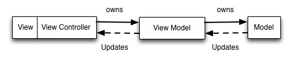
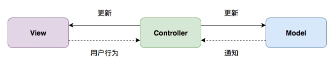
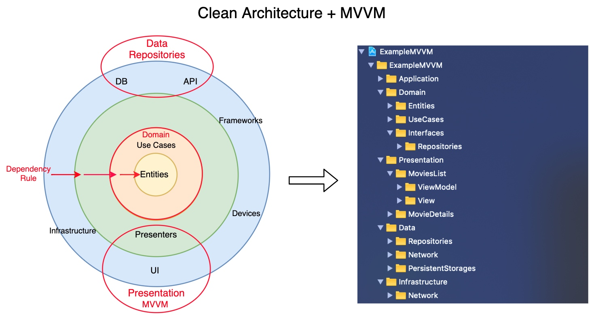
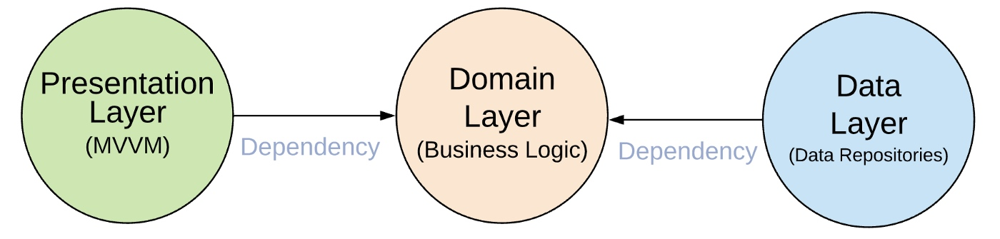
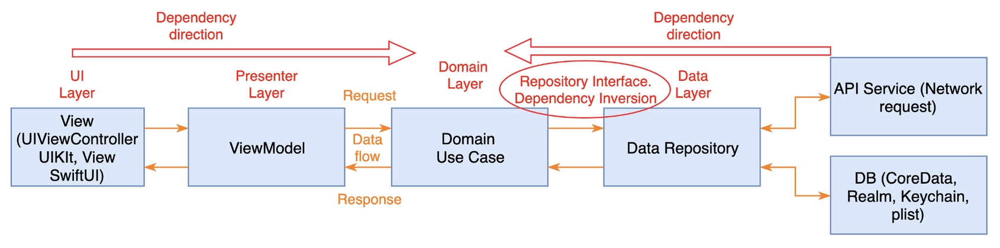

# MVVM
## MVVM 介绍

[ObjC 中国 - MVVM 介绍](https://objccn.io/issue-13-1/)

由于 `UIViewController` 自带一个 `UIView` 和负责管理 `subViews` 的关系，所以很多业务上的逻辑都会放到 `UIViewController` 中进行，这也就导致了 `UViewController` 变得比较庞大，于是开发者想到新增一个可以包含所有逻辑的模块，是的，所有问题都可以通过新增一个中间层来解决。



- MVVM 可以兼容你当下使用的 MVC 架构。（只是把逻辑抽出放到 ViewModel 里）
- MVVM 增加你的应用的可测试性。（通过测试 ViewModel 的输入/输出是否正确）
- MVVM 配合一个绑定机制效果最好。（RxSwift ，ReactiveCocoa ，使用 KVO 自制也可以）

## RxSwift 与 MVVM

[7.1 MVVM](https://beeth0ven.github.io/RxSwift-Chinese-Documentation/content/architecture/mvvm.html)

这里的图片比较好看点，所以再贴一下。

MVC：



上图所示的还是比较舒服的 MVC ，数据都是单向流，一般情况下都是在 `UIViewController` 中一把梭，手动更新 Model 和 View 。

MVVM ：


- **Model** 数据层，读写数据，保存 App 状态
- **View** 页面层，提供用户输入行为，并且显示输出状态
- **ViewModel** 逻辑层，它将用户输入行为，转换成输出状态
- **ViewController** 主要负责数据绑定

简单看一下例子中的 ViewModel 定义：

```swift
class GithubSignupViewModel1 {
    // outputs {

    let validatedUsername: Observable<ValidationResult>
    let validatedPassword: Observable<ValidationResult>
    let validatedPasswordRepeated: Observable<ValidationResult>

    // Is signup button enabled
    let signupEnabled: Observable<Bool>

    // Has user signed in
    let signedIn: Observable<Bool>

    // Is signing process in progress
    let signingIn: Observable<Bool>

    // }

    init(input: (
            username: Observable<String>,
            password: Observable<String>,
            repeatedPassword: Observable<String>,
            loginTaps: Observable<Void>
        ),
        dependency: (
            API: GitHubAPI,
            validationService: GitHubValidationService,
            wireframe: Wireframe
        )
    ) {
        // ... 省略数据处理的代码
    }
}
```

ViewController 负责生成 ViewModel 和数据绑定：

```swift
class GitHubSignupViewController1 : ViewController {

    override func viewDidLoad() {
        super.viewDidLoad()

        let viewModel = GithubSignupViewModel1(
            input: (
                username: usernameOutlet.rx.text.orEmpty.asObservable(),
                password: passwordOutlet.rx.text.orEmpty.asObservable(),
                repeatedPassword: repeatedPasswordOutlet.rx.text.orEmpty.asObservable(),
                loginTaps: signupOutlet.rx.tap.asObservable()
            ),
            dependency: (
                API: GitHubDefaultAPI.sharedAPI,
                validationService: GitHubDefaultValidationService.sharedValidationService,
                wireframe: DefaultWireframe.shared
            )
        )

        // bind results to  {
        viewModel.signupEnabled
            .subscribe(onNext: { [weak self] valid  in
                self?.signupOutlet.isEnabled = valid
                self?.signupOutlet.alpha = valid ? 1.0 : 0.5
            })
            .disposed(by: disposeBag)

        viewModel.validatedUsername
            .bind(to: usernameValidationOutlet.rx.validationResult)
            .disposed(by: disposeBag)

        viewModel.validatedPassword
            .bind(to: passwordValidationOutlet.rx.validationResult)
            .disposed(by: disposeBag)

        viewModel.validatedPasswordRepeated
            .bind(to: repeatedPasswordValidationOutlet.rx.validationResult)
            .disposed(by: disposeBag)

        viewModel.signingIn
            .bind(to: signingUpOulet.rx.isAnimating)
            .disposed(by: disposeBag)

        viewModel.signedIn
            .subscribe(onNext: { signedIn in
                print("User signed in \(signedIn)")
            })
            .disposed(by: disposeBag)
        //}

        let tapBackground = UITapGestureRecognizer()
        tapBackground.rx.event
            .subscribe(onNext: { [weak self] _ in
                self?.view.endEditing(true)
            })
            .disposed(by: disposeBag)
        view.addGestureRecognizer(tapBackground)
    }
}
```

这种数据绑定方式有几个问题是：

1. 所有 input 都必须在 ViewModel 初始化时输入，不支持延迟 input ，比如说有个控件在用户进行了某些操作后才初始化进行显示和输出数据到 ViewModel 中，使用上面的方式就需要提早初始化这个控件。
2. 默认所有模块都支持 Rx ，不支持 Target-Action 方式进行桥接。

## ViewModel in Kickstarter

建议使用 Kickstarter 的方式对 ViewController-ViewModel 进行数据绑定。虽然 Kickstarter 使用的是 ReactiveCocoa 和 ReactiveSwift 。

### 如何定义 inputs 和 outputs

[kickstarter/native-docs](https://github.com/kickstarter/native-docs/blob/master/inputs-outputs.md)

所有 inputs 都是 `MutableProperty` （ RxSwift 中对应的类型为 `BehaviorSubject` ）类型，好处是可以直接进行设置，通过 input 的方法进行传递：

```swift
fileprivate let projectTappedProperty = MutableProperty<Project?>(nil)
public func projectTapped(_ project: Project) {
    self.projectTappedProperty.value = project
}
```

input 变量使用 `Property` 作为为后缀，以表示它是一个 `MutableProperty` 变量，而方法名则表示了所进行的动作。如果 input 值为空，可以通过以下的方式进行设置：

```swift
fileprivate let viewDidLoadProperty = MutableProperty()
public func viewDidLoad() {
    self.viewDidLoadProperty.value = ()
}
```

所有 outputs 都使用 `Signal` （ RxSwift 中对应的类型为 `Observable` ）类型，使用 `NoError` 作为第二个错误参数：

```swift
public let goToDiscovery: Signal<DiscoveryParams, NoError>
```

当 `Signal` 变量没有初始化时， Xcode 会打印相关错误，可以通过设置默认值 `.empty` 来避免这种情况：

```swift
public let goToDiscovery: Signal<DiscoveryParams, NoError> = .empty
```

使用清晰，简洁，明了的命名规则。举个例子，如果 input 是个按钮点击事件，那么使用 `buttonTapped` 作为 input 方法名。如果 output 是一个显示在弹窗中的错误信息，那么可以使用 `showErrorMessageDialog` 。变量名应该可以直接得到以下信息：

1. 如何触发输入操作；
2. 输出应该做哪些事情。

尽量减少其它额外信息。

### ViewModel 定义

[kickstarter/native-docs](https://github.com/kickstarter/native-docs/blob/master/vm-structure.md)

```swift
// {Alphabetized list of imports}
import Models
import ReactiveCocoa
import Result

public protocol ViewModelInputs {
  // {Alphabetized list of input functions with documentation}
  
  /// Call with the project supplied to the view.
  func configureWith(project project: Project)
  
  /// Call when the view loads.
  func viewDidLoad()
}

public protocol ViewModelOutputs {
  // {Alphabetized list of output signals with documentation}
  
  /// Emits the creator's name.
  var creatorName: Signal<String, NoError> { get }
}

public protocol ViewModelType {
  var inputs: ViewModelInputs { get }
  var outputs: ViewModelOutputs { get }
}

public final class ViewModel: ViewModelType, ViewModelInputs, ViewModelOutputs {

  // {Constructor of the view model at the top.}
  
  public init() {
    // {Assign all outputs in terms of the inputs.}
   
    self.creatorName = self.projectProperty.ignoreNil().map { $0.creator.name }
  }
  
  // {Implementation of interfaces at the bottom of the view model.}
  
  // {Alphabetized declaration of all input functions and the `MutableProperty`s that back them.}
  
  private let projectProperty = MutableProperty<Project?>(nil)
  public func configureWith(project project: Project) {
    self.projectProperty.value = project
  }
  private let viewDidLoadProperty = MutableProperty()
  public func viewDidLoad() {
    self.viewDidLoadProperty.value = ()
  }
  
  // {Alphabetized declaration of all output signals}
  
  public let creatorName: Signal<String, NoError> { get }
  
  // {Declaration of inputs/outputs}
  
  public var inputs: ViewModelInputs { return self }
  public var outputs: ViewModelOutputs { return self }
}

// {Private helper methods (optional) at the bottom of the file.}

private func helper() -> String {
  return "Hello"
}
```

可以看到将 inputs 和 outputs 拆成了两个协议： `ViewModelInputs` 和 `ViewModelOutputs` ， `ViewModelInputs` 中都是方法，方便 UI 层调用。再使用 `ViewModelType` 协议对 `ViewModelInputs` 和 `ViewModelOutputs` 进行封装，外界不需要知道 `ViewModel` 的具体类型，只需要知道 `ViewModelType` 协议即可。即使是访问实例变量，也使用 `self` 。这些规则可以大大减少沟通成本，所有人写出来的代码在接口层级都是一致的。

## Clean Architecture and MVVM on iOS

[Clean Architecture and MVVM on iOS](https://tech.olx.com/clean-architecture-and-mvvm-on-ios-c9d167d9f5b3)

从更加整体的角度来说明如何通过 MVVM 来实现一个干净的架构。 Demo 地址：

[https://github.com/kudoleh/iOS-Clean-Architecture-MVVM](https://github.com/kudoleh/iOS-Clean-Architecture-MVVM)



整个应用的架构会分成不同的层级，核心规则就是内部的层级不能依赖外部的层级。



一共分为三层：表现层，业务逻辑层，数据层。业务逻辑层是最内部的层级，它包含了业务 Model ，业务实现和接口，不依赖三方库。业务逻辑不能包含其它层级的东西，比如说表现层的 UIKit 或者 SwiftUI ，数据层的 Codable 映射。

表现层包括 UI 部分 ( UIViewControllers 或者 SwiftUI Views )。Views 由 ViewModels 进行协调，服务于业务逻辑，表现层只依赖业务逻辑层。

数据层则包含了存储实现和一种或者多种数据源。数据层负责协调不同来源的数据。数据源可以是来自于网络请求，也可以是本地的持久化数据。数据层同样也只依赖于业务逻辑层。在数据处理时也可以添加 JSON 转化为特定 Models 的处理，比如说 Decodable 。



数据流：

1. View 调用 ViewModel 的方法；
2. ViewModel 执行业务逻辑；
3. 业务逻辑整合来源于用户和数据层的数据；
4. 每个数据层返回的数据可能来源于网络请求，本地持久化数据或者内存中的数据；
5. 相关信息信息返回给 UI 层，然后进行展示。

依赖方向：

> **Presentation Layer -> Domain Layer <- Data Repositories Layer**
> 

> ***Presentation Layer (MVVM)** = ViewModels(Presenters) + Views(UI)*
> 

> ***Domain Layer** = Entities + Use Cases + Repositories Interfaces*
> 

> ***Data Repositories Layer** = Repositories Implementations + API(Network) + Persistence DB*
> 

### Domain Layer

Domain Layer 负责处理业务逻辑，也包含了 Entities 部分，对应业务中需要处理的 Model ，在 Demo 中就是 `Movie` 和 `MovieQuery` 。以 Demo 中的 `SearchMoviesUseCase` 来简单说明下，其定义了对外提供的能力：

```swift
protocol SearchMoviesUseCase {
    func execute(requestValue: SearchMoviesUseCaseRequestValue,
                 cached: @escaping (MoviesPage) -> Void,
                 completion: @escaping (Result<MoviesPage, Error>) -> Void) -> Cancellable?
}
```

而 Interfaces/Repositories 则定义了数据层应该实现的相关接口：

```swift
protocol MoviesRepository {
    @discardableResult
    func fetchMoviesList(query: MovieQuery, page: Int,
                         cached: @escaping (MoviesPage) -> Void,
                         completion: @escaping (Result<MoviesPage, Error>) -> Void) -> Cancellable?
}

protocol MoviesQueriesRepository {
    func fetchRecentsQueries(maxCount: Int, completion: @escaping (Result<[MovieQuery], Error>) -> Void)
    func saveRecentQuery(query: MovieQuery, completion: @escaping (Result<MovieQuery, Error>) -> Void)
}
```

而 `DefaultSearchMoviesUseCase` 则提供了 `SearchMoviesUseCase` 的默认实现，初始化参数包括 `MoviesRepository` 和 `MoviesQueriesRepository` ，上层可以通过依赖注入实现这两个协议，为 `DefaultSearchMoviesUseCase` 提供数据层的功能：

```swift
final class DefaultSearchMoviesUseCase: SearchMoviesUseCase {

    private let moviesRepository: MoviesRepository
    private let moviesQueriesRepository: MoviesQueriesRepository
    
    init(moviesRepository: MoviesRepository, moviesQueriesRepository: MoviesQueriesRepository) {
        self.moviesRepository = moviesRepository
        self.moviesQueriesRepository = moviesQueriesRepository
    }
    
    func execute(requestValue: SearchMoviesUseCaseRequestValue,
                 completion: @escaping (Result<MoviesPage, Error>) -> Void) -> Cancellable? {
        return moviesRepository.fetchMoviesList(query: requestValue.query, page: requestValue.page) { result in
            
            if case .success = result {
                self.moviesQueriesRepository.saveRecentQuery(query: requestValue.query) { _ in }
            }

            completion(result)
        }
    }
}
```

也可以使用通用的 `UseCase` 协议：

```swift
public protocol UseCase {
    @discardableResult
    func start() -> Cancellable?
}
```

通用的 `UseCase` 协议只有一个 `start` 的方法，会返回一个 `cancellable` 协议，如果说要使用 `UseCase` 协议，可以在初始化时设置相关的 `closure` 回调， `start` 时进行设置：

```swift
final class FetchRecentMovieQueriesUseCase: UseCase {

    struct RequestValue {
        let maxCount: Int
    }
    typealias ResultValue = (Result<[MovieQuery], Error>)

    private let requestValue: RequestValue
    private let completion: (ResultValue) -> Void
    private let moviesQueriesRepository: MoviesQueriesRepository

    init(requestValue: RequestValue,
         completion: @escaping (ResultValue) -> Void,
         moviesQueriesRepository: MoviesQueriesRepository) {

        self.requestValue = requestValue
        self.completion = completion
        self.moviesQueriesRepository = moviesQueriesRepository
    }
    
    func start() -> Cancellable? {

        moviesQueriesRepository.fetchRecentsQueries(maxCount: requestValue.maxCount, completion: completion)
        return nil
    }
}
```

### Presentation Layer

Presentaion Layer 包括 ViewModel ， Behavior ，Coordinator 和 View 四部分：

1. ViewModel 负责处理 UI 层的业务逻辑，但是不会包含任何特定的 UI 对象，这样可以 UI 层可以很方便地进行切换，比如说可以在 UIKit ， SwiftUI 或者 WatchKit 之间替换，从而复用 ViewModel 的逻辑， ViewModel 的定义和上面提到的相同，都是使用 `protocol` 进行定义；
2. 使用 Flow Coordinator 来处理 ViewController 之间的跳转，以此来减少 ViewController 的代码量和指责；
3. ViewController 只负责绑定 View 和 ViewModel ，不做其它处理；
4. View 只和 ViewModel 进行交互，不直接处理业务层的 Model 。

### Data Layer

Data Layer 分为 Repositories ，Network 和 PersistentStorages 三部分。

Repositories 实现了 Domain Layer 层的 `protocol` ，其作用是负责串联网络请求数据和本地持久化部分。比如说 `DefaultMoviesRepository` ，其 `fetchMoviesList` 的逻辑是先查询缓存是否有对应的数据，如果有，就调用 `cached` 回调，同时进行网络请求，获取最新的数据：

```swift
final class DefaultMoviesRepository {

    private let dataTransferService: DataTransferService
    private let cache: MoviesResponseStorage

    init(dataTransferService: DataTransferService, cache: MoviesResponseStorage) {
        self.dataTransferService = dataTransferService
        self.cache = cache
    }
}

extension DefaultMoviesRepository: MoviesRepository {

    public func fetchMoviesList(query: MovieQuery, page: Int,
                                cached: @escaping (MoviesPage) -> Void,
                                completion: @escaping (Result<MoviesPage, Error>) -> Void) -> Cancellable? {

        let requestDTO = MoviesRequestDTO(query: query.query, page: page)
        let task = RepositoryTask()

        cache.getResponse(for: requestDTO) { result in

            if case let .success(responseDTO?) = result {
                cached(responseDTO.toDomain())
            }
            guard !task.isCancelled else { return }

            let endpoint = APIEndpoints.getMovies(with: requestDTO)
            task.networkTask = self.dataTransferService.request(with: endpoint) { result in
                switch result {
                case .success(let responseDTO):
                    self.cache.save(response: responseDTO, for: requestDTO)
                    completion(.success(responseDTO.toDomain()))
                case .failure(let error):
                    completion(.failure(error))
                }
            }
        }
        return task
    }
}
```

DTO 为 Data Transfer Object 的缩写，表示从 JSON 转换而来的对象。同时也可以将请求的结果进行持久化，比如说从 DTO 转换为 `NSManagedObject` 。 `DataTransferService` 和 `MoviesResponseStorage` 都是协议， `Repository` 并不关心其具体实现，只需要有提供相关接口即可，比如说数据层可以从 CoreData 迁移到 Realm 。

### Infrastructure Layer

基础架构层，比较简单，只提供了网络接口相关的处理。

### 总结

MVVM 只在表现层内部提供功能分离，而  Clean Architecture 则在全局对代码进行拆分，分为不同的层级，使得代码易于测试、重用和理解。作者的观点是不要跳过每个层级和特定模块的创建，即使这些层级和模块的代码量可能会比较少，但是从整体上来看更加清晰了，当有新的开发同学加入时，整个架构一目了然。虽然说 Clean Architecture 是一个非常好架构，但是在实际项目中没有银弹存在，我们需要根据项目的实际情况来选择适合的机构。其它一些建议：

1. 不要在没有测试的情况下编写代码；
2. 持续重构；
3. 不要过度设计，要务实；
4. 尽量避免在项目中使用第三方框架依赖（这点持保留意见）。