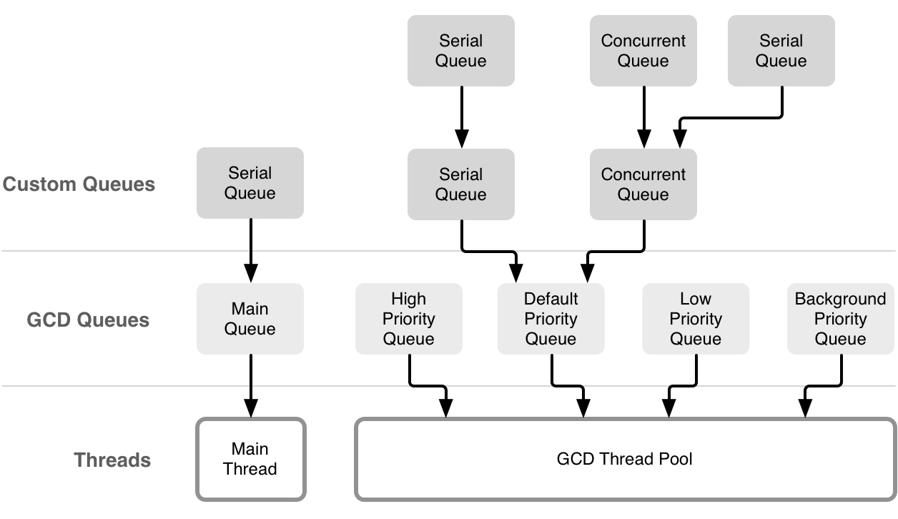

# 多线程导读
## 官方文档

[Introduction](https://developer.apple.com/library/archive/documentation/Cocoa/Conceptual/Multithreading/Introduction/Introduction.html)

中文版本：

[Threading Programming Guide(1)](http://yulingtianxia.com/blog/2017/08/28/Threading-Programming-Guide-1/)

[Threading Programming Guide(2)](http://yulingtianxia.com/blog/2017/09/17/Threading-Programming-Guide-2/)

[Threading Programming Guide(3)](http://yulingtianxia.com/blog/2017/10/08/Threading-Programming-Guide-3/)

## 官方的并行编程指南

[Concurrency and Application Design](https://developer.apple.com/library/archive/documentation/General/Conceptual/ConcurrencyProgrammingGuide/ConcurrencyandApplicationDesign/ConcurrencyandApplicationDesign.html)

### 远离线程

### 为什么要使用并行编程

1. 充分利用计算机的多核；
2. 更好的用户体验。

### 为什么避免使用线程（`NSThread`）

1. 使用 `NSThread` 你需要自己管理线程池；
2. 需要根据系统的状态调整线程的数量；
3. 需要保持线程的高效运行，避免互相干扰。

### Dispatch Queues

Dispatch Queues 是一种基于 C 的机制，可执行自定义任务，支持串行和并行，任务按照 FIFO 顺序执行。
优点：

- 提供直观简单的接口；
- 提供自动和全面的线程池管理；
- 提供了优化后的速度；
- 更高效率的内存占用（线程栈帧不需要常驻内存）；
- 不需要与内核交互；
- 分发到异步队列的任务不会造成队列死锁；
- 优雅的扩展；
- 串行队列提供了一个比锁或者其它原始的同步方案更高效的替代品。

### Dispatch Sources

Dispatch Sources 是一种基于 C 的机制，用于异步处理特定类型的系统。 Dispatch Source 会包含有关特定类型系统事件的信息，在事件发生时将特定的 block 提交给 Dispatch Queue 。你可以使用 Dispatch Sources 来监听以下几种类型的系统事件：

- Timer 定时器；
- Signal 监听UNIX信号；
- Descriptor-related events 监听文件和 Socket 相关操作；
- Process-related events 监听进程相关状态；
- Mach port events 监听 Mach 相关事件；
- Custom events that you trigger 监听自定义事件；

Dispatch sources 是 GCD 的一部分。

### Operation Queues

Operation Queue 是 Cocoa 提供的，和并行的 Dispatch Queue 是相同概念的东西，具体类型为 `NSOperationQueue` 类。跟 Dispatch Queue 保持 FIFO 的执行顺序不同， Operation Queue 支持自定义的执行顺序。你可以在定义任务时设置相关的依赖，以此来创造一个复杂的执行顺序图。

Operation Queue 中任务对应的类型为 `NSOperation` 类。`NSOperation` 封装了你需要执行的任务和所有相关的数据。 `NSOperation` 是一个抽象的基类，你可以自定义一些子类来执行自己的任务。系统也提供了一些特定的子类。

`NSOperation` 提供了 KVO 通知，可用于监听任务的进度。Operation Queue 通常会并发执行任务，你可以通过设置依赖来保证它们按照所计划的顺序执行。

### Asynchronous Design Techniques

### Define Your Application’s Expected Behavior

当你想要给自己的应用添加并发代码时，你应该先定义好应用的预期行为，以此来验证接入并发编程后的行为是否正确以及测试性能收益。

定义相关任务和数据结构。理清各个任务间的依赖关系。

### Factor Out Executable Units of Work

找出任务的最小执行单元，将其封装进 `block` 或者 `NSOperation` ，然后派发到适当的队列中。不用担心任务分得太细而影响性能。队列会帮你处理好这一切，当然了，最好还是通过性能测试来调整任务大小。

### Identify the Queues You Need

确定好队列的属性。
当使用 GCD 时，如果需要特定的执行顺序，使用串行队列，如果不需要特定的执行队列，可使用并发队列或者多个队列。
当使用 `NSOperation` 时，可通过设置各个 `NSOperation` 之间的依赖来调整它们之间的执行顺序。

### Tips for Improving Efficiency

- 如果你的应用已经受内存限制，那么现在直接使用计算值可能比从主内存加载缓存的值要快。 计算值直接使用处理器核心的寄存器和缓存，这比主内存快得多。 当然了，还是需要性能测试来确定是否有利于性能优化；
- 找出串行任务，尽力把它们变得更加并发。 如果由于某个任务依赖某些共享资源而必须串行执行该任务，请考虑更改架构以删除该共享资源。 可以考虑为每个需要共享资源的用户拷贝一份对应的资源，或者完全清除共享资源；
- 避免使用锁。Dispatch queue 和 Operation Queue 在大多数情况下都不需要使用锁。避免使用锁来保护共享资源，使用串行队列或者设置 NSOperation 间的依赖来确保以正确的顺序执行任务；
- 尽量使用系统框架。实现功能时优先考虑现有的系统 API 是否可以满足需求。

## 相关分类

[NSOperation](./NSOperation.md) 

[Grand Central Dispatch](./Grand-Central-Dispatch.md) 

[pthread 和 NSThread](https://www.notion.so/pthread-NSThread-c2839897019440aba14acdae51166ce5) 

[Lock](https://www.notion.so/Lock-794065e788bb4741a870c4434323de5b) 

## 相关文章

### ObjC 专题

[ObjC 中国 - 并发编程：API 及挑战](https://objccn.io/issue-2-1/)

[ObjC 中国 - 底层并发 API](https://objccn.io/issue-2-3/)

[ObjC 中国 - 线程安全类的设计](https://objccn.io/issue-2-4/)

[ObjC 中国 - 测试并发程序](https://objccn.io/issue-2-5/)



### Sindrilin 关于多线程的文章

[thread_safe](http://sindrilin.com/2017/09/09/thread_safe.html)

如何保证线程安全，从原子性到线程锁（互斥，自旋，信号量），也说到了 `barrier` 操作。

[producers_consumers](http://sindrilin.com/2017/09/27/producers_consumers.html)

### NetNewsWire 如何处理多线程

[How NetNewsWire Handles Threading](https://inessential.com/2021/03/20/how_netnewswire_handles_threading)

- 大部分代码都在主线程运行；
- 通知和 `callback` 也都是在主线程处理；
- 对于耗时操作，使用纯函数和串行队列，通过 `callback` 返回处理结果；
- 数据库的存取也使用串行队列，外部无法获取内部实现，可获取到的数据都是通过 `callback` 和异步派发到主线程进行；
- 多使用 `assert(Thread.isMainThread)` 和 `precondition(Thread.isMainThread)` 来判断是否为主线程。

NetNewsWire 在响应和运行上都非常快速，同时也非常稳定。上述策略的好处是开发者通过查看代码就可以了解当前代码是在哪个线程上运行的，几乎全部代码都是在主线程运行。如果你在处理 RSS 解析，数据库或者其它类似的耗时操作，那么就是在串行队列中进行。即使是接入 Combine ， SwiftUI 和 Concurrency ，也可以继续使用这套策略。虽然线程机制的内部有调整，但是对外提供的逻辑是一致的。

作者认为高级开发者应该尽可能地减少多线程的部分，保持应用简单。因为多线程的代码很难去维护和阅读，虽然你可能创造出一套机制来正确使用多线程，但是团队互相理解代码也是有成本的，即使是独立开发者，你和六个月之后的你也是一个团队。虽然有可能阻塞主线程，但是解决一个主线程阻塞的 BUG 比解决一个奇怪的，不稳定复现的多线程的 BUG 或者崩溃要好多了。

对于主线程的阻塞，可以使用 Time Profiler 来排查，一般有以下三种解决方案：

1. 通过数据结构和算法来进行优化；
2. 或许是一些不必要的操作；
3. 最后的解决方案：迁移到后台串行队列中进行。

最后的实操建议：

- 明确标注哪些应该在主线中运行，在代码中通过 `assert(Thread.isMainThread)` 进行判断；
- 开启 Xcode 的 Main Thread Checker ；
- 确保你 App 上所有的 `Notification` 都是在主线程进行，在回调中添加 `assert(Thread.isMainThread)` 。

更激进点可以使用 `precondition(Thread.isMainThread)` 代替 `assert(Thread.isMainThread)` ，前者在生产环境下也会崩溃，确保你的线程模型正常运行。

对于 GCD 或者 `NSOperation` 的 API 的错误调用，改动成本不大，而对于整个 App 的线程模型来说，在工程创建之初就会确定下来，或者怎么高兴怎么来，又或者根据不同的业务分配不同的队列，在发展到一定阶段后再来修改避免不了会有一定的成本。我的观点和作者一致：尽量避免多线程。

### Swift 专题

[Swift 中的并发编程(第一部分：现状）](https://swift.gg/2017/09/04/all-about-concurrency-in-swift-1-the-present/)

这篇文章介绍了 Swift 未支持协程 ( `async/await` )前的并发编程模式，很好地总结了 Swift 中目前可用的外部并发框架，包括锁类型， GCD 和操作队列。

Swift 3 中已经去掉了 `dispatch_once` ， `dispatch_once` 在 Objective-C 中常用于构建线程安全的单例。在 Swift 中可以通过全局常量来初始化单例，Swift 确保使用原子化的方式来进行初始化：

```swift
final class Singleton {

    public static let sharedInstance: Singleton = Singleton()

    private init() { }

    ...
}
```

也可以通过串行队列加 token 实现类似 `dispatch_once` 功能：

```swift
import Foundation

public extension DispatchQueue {
    
    private static var onceTokens = [Int]()
    private static var internalQueue = DispatchQueue(label: "dispatchqueue.once")
    
    public class func once(token: Int, closure: (Void)->Void) {
        internalQueue.sync {
            if onceTokens.contains(token) {
                return
            }else{
                onceTokens.append(token)
            }
            closure()
        }
    }
}

let t = 1
DispatchQueue.once(token: t) {
    print("only once!")
}
DispatchQueue.once(token: t) {
    print("Two times!?")
}
DispatchQueue.once(token: t) {
    print("Three times!!?")
}
```

Swift 3 新增了一个函数，可用于判断任务是否在预期的队列中执行， `DispatchPredicate` 提供了三个枚举值：

- `onQueue` ：验证任务是否在指定队列中执行；
- `notOnQueue` ：与 `onQueue` 情况相反；
- `onQueueAsBarrier` ：验证当前任务是否作为一个队列的屏障。

```swift
dispatchPrecondition(condition: .notOnQueue(mainQueue))
dispatchPrecondition(condition: .onQueue(queue))
```

### 重点

[iOS探索 多线程面试题分析](https://juejin.im/post/6844904138623418376)