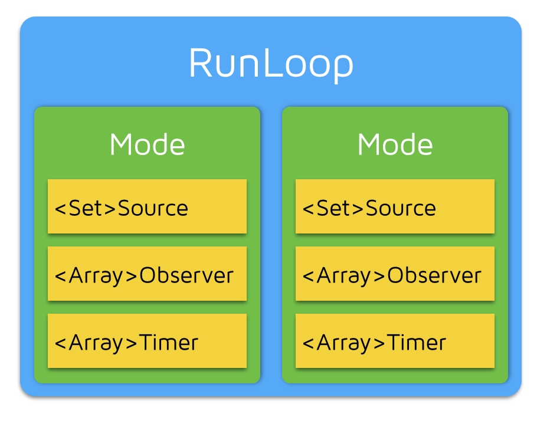

## 官方文档

[Run Loops](https://developer.apple.com/library/archive/documentation/Cocoa/Conceptual/Multithreading/RunLoopManagement/RunLoopManagement.html)

## 深入理解 RunLoop

[深入理解RunLoop](https://blog.ibireme.com/2015/05/18/runloop/)

这篇文章写得非常好，推荐反复阅读。

RunLoop 相关类和关系图：



一个 RunLoop 包含若干个 Mode，每个 Mode 又包含若干个 Source/Timer/Observer 。每次调用 RunLoop 的主函数时，只能指定其中一个 Mode，这个Mode被称作 CurrentMode 。如果需要切换 Mode ，只能退出 Loop，再重新指定一个 Mode 进入。这样做主要是为了分隔开不同组的 Source/Timer/Observer ，让其互不影响。

RunLoop 通知 Observers 的流程：


RunLoop 的应用：

1. AutoreleasePool ，苹果在主线程的 RunLoop 里注册了两个 Observer ，其回调都是 `_wrapRunLoopWithAutoreleasePoolHandler()` 。第一个 Observer 监听 Entry ，调用 `_objc_autoreleasePoolPush()` 创建 AutoreleasePool ， order 是 -2147483647 ，优先级最高，这样可以在其它回调之前就进行创建 AutoreleasePool 。第二个 Observer 监听了 BeforeWaiting 和 Exit ， BeforeWaiting 时调用 `_objc_autoreleasePoolPop()` 来退出旧的 AutoreleasePool ，然后调用 `_objc_autoreleasePoolPush()` 来创建新的 AutoreleasePool ，给下一轮使用。而在 Exit 时也会调用 `_objc_autoreleasePoolPop()` 来退出 AutoreleasePool ， Observer 的优先级是 2147483647 ，优先级最低，确保在最后进行处理；
2. 事件响应，注册了一个基于 mach port 的 Source1 来接收系统事件，流程：IOKit.framework 生成 IOHIDEvent 事件 → SpringBoard 接收 → mach port 转发给 App → 触发 Source1 回调 → `_UIApplicationHandleEventQueue()` 进行分发。包括点击事件/屏幕旋转等；
3. 界面更新，在操作 UI 时，比如更新 `frame` ，对 `UIView/CALayer` 视图相关的属性进行操作，或者手动调用 `setNeedsLayout/setNeedsDisplay` 方法后，系统会将记录这个 `UIView/CALayer` ，然后通过监听 BeforeWaiting 和 Exit 事件，执行 `_ZN2CA11Transaction17observer_callbackEP19__CFRunLoopObservermPv()` ，在这里面对所有待处理的 `UIView/CALayer` 进行绘制，更新界面；
4. `NSTimer` 回调， `NSTimer` 其实是 `CFRunLoopTimerRef` 的桥接， `NSTimer` 注册到 RunLoop 后， RunLoop 会持有这个 `NSTimer` ，直到 `invalidate` 或者方法执行完毕。所以如果 `NSTimer` 的 `repeat` 为 `YES` 及和强引用 `target` 时，会导致 `NSTimer` 和 `target`  无法释放。且如果 RunLoop 切换了 mode ，而对应的 `NSTimer` 没有添加到 commonMode ，那么 `NSTimer` 就不会执行；
5. `NSObject` 调用 `performSelector:afterDelay:` 后，内部会创建一个 `Timer` 添加到当前线程的 RunLoop 中，如果说当前线程没有 RunLoop ，那么这个方法就会失效。 `performSelector:onThread:` 则可以指定对应的线程；
6. 通过 GCD 的 `dispatch_async(dispatch_get_main_queue(), block)` 切换到主队列执行 `block` 时， libDispatch 会向主线程 RunLoop 发送消息，唤醒 RunLoop ，然后从消息中获取和执行 `block` 。

关于线程保活：

线程在执行完任务后就会退出和销毁，通过创建 RunLoop 和添加 Timer/Observer/Source 到 RunLoop 中，使得线程不退出，这样可以在该线程中接收和处理消息。比较经典的是 AFNetworking 2.0 中的做法：

```cpp
+ (NSThread *)networkRequestThread {
    static NSThread *_networkRequestThread = nil;
    static dispatch_once_t oncePredicate;
    dispatch_once(&oncePredicate, ^{
        _networkRequestThread = [[NSThread alloc] initWithTarget:self selector:@selector(networkRequestThreadEntryPoint:) object:nil];
        [_networkRequestThread start];
    });
    return _networkRequestThread;
}

+ (void)networkRequestThreadEntryPoint:(id)__unused object {
    @autoreleasepool {
        [[NSThread currentThread] setName:@"AFNetworking"];
        // 在当前线程创建 RunLoop
        NSRunLoop *runLoop = [NSRunLoop currentRunLoop];
        // 添加一个 NSMachPort ，防止 RunLoop 退出
        [runLoop addPort:[NSMachPort port] forMode:NSDefaultRunLoopMode];
        // 启动 RunLoop
				[runLoop run];
    }
}
```

Texture 也依赖 RunLoop 的机制，将耗时的不需要在主线程进行的操作放到后台线程中进行，然后添加一个 Observer 到 RunLoop 中，监听了 `kCFRunLoopBeforeWaiting` 和 `kCFRunLoopExit` 事件，在 RunLoop 休眠前在主线程提交相关事务，对 UI 进行修改。相关实现：

[Texture/_ASAsyncTransactionGroup.mm at master · TextureGroup/Texture](https://github.com/TextureGroup/Texture/blob/master/Source/Details/Transactions/_ASAsyncTransactionGroup.mm)

流程代码：

```objectivec
{
    /// 1. 通知Observers，即将进入RunLoop
    /// 此处有Observer会创建AutoreleasePool: _objc_autoreleasePoolPush();
    __CFRUNLOOP_IS_CALLING_OUT_TO_AN_OBSERVER_CALLBACK_FUNCTION__(kCFRunLoopEntry);
    do {
 
        /// 2. 通知 Observers: 即将触发 Timer 回调。
        __CFRUNLOOP_IS_CALLING_OUT_TO_AN_OBSERVER_CALLBACK_FUNCTION__(kCFRunLoopBeforeTimers);
        /// 3. 通知 Observers: 即将触发 Source (非基于port的,Source0) 回调。
        __CFRUNLOOP_IS_CALLING_OUT_TO_AN_OBSERVER_CALLBACK_FUNCTION__(kCFRunLoopBeforeSources);
        __CFRUNLOOP_IS_CALLING_OUT_TO_A_BLOCK__(block);
 
        /// 4. 触发 Source0 (非基于port的) 回调。
        __CFRUNLOOP_IS_CALLING_OUT_TO_A_SOURCE0_PERFORM_FUNCTION__(source0);
        __CFRUNLOOP_IS_CALLING_OUT_TO_A_BLOCK__(block);
 
        /// 6. 通知Observers，即将进入休眠
        /// 此处有Observer释放并新建AutoreleasePool: _objc_autoreleasePoolPop(); _objc_autoreleasePoolPush();
        __CFRUNLOOP_IS_CALLING_OUT_TO_AN_OBSERVER_CALLBACK_FUNCTION__(kCFRunLoopBeforeWaiting);
 
        /// 7. sleep to wait msg.
        mach_msg() -> mach_msg_trap();
        
 
        /// 8. 通知Observers，线程被唤醒
        __CFRUNLOOP_IS_CALLING_OUT_TO_AN_OBSERVER_CALLBACK_FUNCTION__(kCFRunLoopAfterWaiting);
 
        /// 9. 如果是被Timer唤醒的，回调Timer
        __CFRUNLOOP_IS_CALLING_OUT_TO_A_TIMER_CALLBACK_FUNCTION__(timer);
 
        /// 9. 如果是被dispatch唤醒的，执行所有调用 dispatch_async 等方法放入main queue 的 block
        __CFRUNLOOP_IS_SERVICING_THE_MAIN_DISPATCH_QUEUE__(dispatched_block);
 
        /// 9. 如果如果Runloop是被 Source1 (基于port的) 的事件唤醒了，处理这个事件
        __CFRUNLOOP_IS_CALLING_OUT_TO_A_SOURCE1_PERFORM_FUNCTION__(source1);
 
 
    } while (...);
 
    /// 10. 通知Observers，即将退出RunLoop
    /// 此处有Observer释放AutoreleasePool: _objc_autoreleasePoolPop();
    __CFRUNLOOP_IS_CALLING_OUT_TO_AN_OBSERVER_CALLBACK_FUNCTION__(kCFRunLoopExit);
}
```

详细的代码：

```objectivec
/// 用DefaultMode启动
void CFRunLoopRun(void) {
    CFRunLoopRunSpecific(CFRunLoopGetCurrent(), kCFRunLoopDefaultMode, 1.0e10, false);
}
 
/// 用指定的Mode启动，允许设置RunLoop超时时间
int CFRunLoopRunInMode(CFStringRef modeName, CFTimeInterval seconds, Boolean stopAfterHandle) {
    return CFRunLoopRunSpecific(CFRunLoopGetCurrent(), modeName, seconds, returnAfterSourceHandled);
}
 
/// RunLoop的实现
int CFRunLoopRunSpecific(runloop, modeName, seconds, stopAfterHandle) {
    
    /// 首先根据modeName找到对应mode
    CFRunLoopModeRef currentMode = __CFRunLoopFindMode(runloop, modeName, false);
    /// 如果mode里没有source/timer/observer, 直接返回。
    if (__CFRunLoopModeIsEmpty(currentMode)) return;
    
    /// 1. 通知 Observers: RunLoop 即将进入 loop。
    __CFRunLoopDoObservers(runloop, currentMode, kCFRunLoopEntry);
    
    /// 内部函数，进入loop
    __CFRunLoopRun(runloop, currentMode, seconds, returnAfterSourceHandled) {
        
        Boolean sourceHandledThisLoop = NO;
        int retVal = 0;
        do {
 
            /// 2. 通知 Observers: RunLoop 即将触发 Timer 回调。
            __CFRunLoopDoObservers(runloop, currentMode, kCFRunLoopBeforeTimers);
            /// 3. 通知 Observers: RunLoop 即将触发 Source0 (非port) 回调。
            __CFRunLoopDoObservers(runloop, currentMode, kCFRunLoopBeforeSources);
            /// 执行被加入的block
            __CFRunLoopDoBlocks(runloop, currentMode);
            
            /// 4. RunLoop 触发 Source0 (非port) 回调。
            sourceHandledThisLoop = __CFRunLoopDoSources0(runloop, currentMode, stopAfterHandle);
            /// 执行被加入的block
            __CFRunLoopDoBlocks(runloop, currentMode);
 
            /// 5. 如果有 Source1 (基于port) 处于 ready 状态，直接处理这个 Source1 然后跳转去处理消息。
            if (__Source0DidDispatchPortLastTime) {
                Boolean hasMsg = __CFRunLoopServiceMachPort(dispatchPort, &msg)
                if (hasMsg) goto handle_msg;
            }
            
            /// 通知 Observers: RunLoop 的线程即将进入休眠(sleep)。
            if (!sourceHandledThisLoop) {
                __CFRunLoopDoObservers(runloop, currentMode, kCFRunLoopBeforeWaiting);
            }
            
            /// 7. 调用 mach_msg 等待接受 mach_port 的消息。线程将进入休眠, 直到被下面某一个事件唤醒。
            /// • 一个基于 port 的Source 的事件。
            /// • 一个 Timer 到时间了
            /// • RunLoop 自身的超时时间到了
            /// • 被其他什么调用者手动唤醒
            __CFRunLoopServiceMachPort(waitSet, &msg, sizeof(msg_buffer), &livePort) {
                mach_msg(msg, MACH_RCV_MSG, port); // thread wait for receive msg
            }
 
            /// 8. 通知 Observers: RunLoop 的线程刚刚被唤醒了。
            __CFRunLoopDoObservers(runloop, currentMode, kCFRunLoopAfterWaiting);
            
            /// 收到消息，处理消息。
            handle_msg:
 
            /// 9.1 如果一个 Timer 到时间了，触发这个Timer的回调。
            if (msg_is_timer) {
                __CFRunLoopDoTimers(runloop, currentMode, mach_absolute_time())
            } 
 
            /// 9.2 如果有dispatch到main_queue的block，执行block。
            else if (msg_is_dispatch) {
                __CFRUNLOOP_IS_SERVICING_THE_MAIN_DISPATCH_QUEUE__(msg);
            } 
 
            /// 9.3 如果一个 Source1 (基于port) 发出事件了，处理这个事件
            else {
                CFRunLoopSourceRef source1 = __CFRunLoopModeFindSourceForMachPort(runloop, currentMode, livePort);
                sourceHandledThisLoop = __CFRunLoopDoSource1(runloop, currentMode, source1, msg);
                if (sourceHandledThisLoop) {
                    mach_msg(reply, MACH_SEND_MSG, reply);
                }
            }
            
            /// 执行加入到Loop的block
            __CFRunLoopDoBlocks(runloop, currentMode);
            
 
            if (sourceHandledThisLoop && stopAfterHandle) {
                /// 进入loop时参数说处理完事件就返回。
                retVal = kCFRunLoopRunHandledSource;
            } else if (timeout) {
                /// 超出传入参数标记的超时时间了
                retVal = kCFRunLoopRunTimedOut;
            } else if (__CFRunLoopIsStopped(runloop)) {
                /// 被外部调用者强制停止了
                retVal = kCFRunLoopRunStopped;
            } else if (__CFRunLoopModeIsEmpty(runloop, currentMode)) {
                /// source/timer/observer一个都没有了
                retVal = kCFRunLoopRunFinished;
            }
            
            /// 如果没超时，mode里没空，loop也没被停止，那继续loop。
        } while (retVal == 0);
    }
    
    /// 10. 通知 Observers: RunLoop 即将退出。
    __CFRunLoopDoObservers(rl, currentMode, kCFRunLoopExit);
}
```

## `NSRunLoop` Internals

[mikeash.com: Friday Q&A 2010-01-01: NSRunLoop Internals](https://www.mikeash.com/pyblog/friday-qa-2010-01-01-nsrunloop-internals.html)

`NSRunLoop` 伪代码。

`run` 方法的实现非常简单，先判断是否有 Source 或者 Timer ，如果没有，就直接退出：

```objectivec
- (void)run
{
    while([self hasSourcesOrTimers])
        [self runMode: NSDefaultRunLoopMode beforeDate: [NSDate distantFuture]];
}

- (void)runUntilDate: (NSDate *)limitDate
{
    while([self hasSourcesOrTimers])
    {
        [self runMode: NSDefaultRunLoopMode beforeDate: limitDate];
            
        // check limitDate at the end of the loop to ensure that
        // the runloop always runs at least once
        if([limitDate timeIntervalSinceNow] < 0)
            break;
    }
}
```

`NSRunLoop` 提供了添加 Source 的方法：

```objectivec
- (void)addPort: (NSPort *)aPort forMode: (NSString *)mode
{
    NSMutableSet *sourcesSet = [_inputSources objectForKey: mode];
    if(!sourcesSet)
    {
        // 如果当前 mode 还没有创建关于 source 的 NSMutableSet ，就动态创建一个
        sourcesSet = [NSMutableSet set];
        [_inputSources setObject: sourcesSet forKey: mode];
    }
    [sourcesSet addObject: aPort];
}
```

同时也有对应的移除 Source 方法：

```objectivec
- (void)removePort: (NSPort *)aPort forMode: (NSString *)mode
{
    NSMutableSet *sourcesSet = [_inputSources objectForKey: mode];
    [sourcesSet removeObject: aPort];
        
    // 如果 source 的 NSMutableSet 为空，则移除
    if(![sourcesSet count])
        [_inputSources removeObjectForKey: mode];
}
```

```objectivec
- (BOOL)runMode: (NSString *)mode beforeDate: (NSDate *)limitDate
{
    // 如果没有 Source 或者 Timer ，就直接退出
    if(![self hasSourcesOrTimersForMode: mode])
        return NO;
        
    // with timer support, this code has to loop until an input
    // source fires
    // 
    BOOL didFireInputSource = NO;
    while(!didFireInputSource)
    {
        fd_set fdset;
        FD_ZERO(&fdset);
            
        for(inputSource in [_inputSources objectForKey: mode])
            FD_SET([inputSource fileDescriptor], &fdset);
        // 根据 limitDate 获取 timeout
        NSTimeInterval timeout = [limitDate timeIntervalSinceNow];
            
        // 选择 timeout 和 timerSources 中最小值
        for(timer in [_timerSources objectForKey: mode])
            timeout = MIN(timeout, [[timer fireDate] timeIntervalSinceNow]);

        select(fdset, timeout);
            
        // 处理 Source
        for(inputSource in [[[_inputSources objectForKey: mode] copy] autorelease])
            if(FD_ISSET([inputSource fileDescrptor], &fdset))
            {
                didFireInputSource = YES;
                [inputSource fileDescriptorIsReady];
            }

        // 处理 Timer ，根据 fireDate 判断是否要调用 Timer 的 fire 方法，执行对应的事件
        // 根据 repeat 是否为 YES 判断要不要移除 Timer
        for(timer in [[[_timerSources objectForKey: mode] copy] autorelease])
            if([[timer fireDate] timeIntervalSinceNow] <= 0)
                [timer fire];

        // 如果已经超出了 limitDate 的时间戳，就立即返回
        if([limitDate timeIntervalSinceNow] < 0)
            break;
    }
    return YES;
}
```