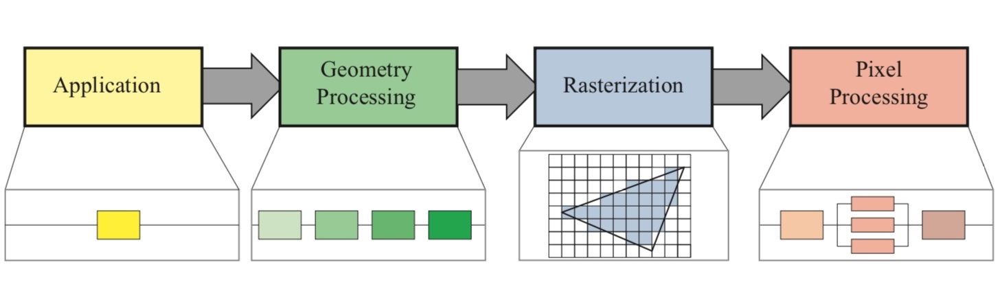

# FPS 优化
## 如何检测卡顿

[质量监控-卡顿检测](https://juejin.cn/post/6844903686620053512)

[iOS卡顿监测方案总结](https://juejin.cn/post/6844903944867545096)

### 基于 `CADisplayLink`

[ibireme/YYText](https://github.com/ibireme/YYText/blob/master/Demo/YYTextDemo/YYFPSLabel.m)

`CADisplayLink` 支持以和屏幕刷新率同步的方式更新屏幕上的内容，当注册到 `RunLoop` 后，每次当屏幕时，都会执行 `CADisplayLink` 的方法，与 `NSTimer` 不同的时其内部操作的是一个 `Source` 。 `YYKit` 中通过 `CADisplayLink` 写了个 debug 时显示 FPS的小工具：

```objectivec
- (void)tick:(CADisplayLink *)link {
    if (_lastTime == 0) {
        _lastTime = link.timestamp;
        return;
    }
    
    _count++;
    NSTimeInterval delta = link.timestamp - _lastTime;
    if (delta < 1) return;
    _lastTime = link.timestamp;
    float fps = _count / delta;
    _count = 0;
    
    CGFloat progress = fps / 60.0;
    UIColor *color = [UIColor colorWithHue:0.27 * (progress - 0.2) saturation:1 brightness:0.9 alpha:1];
    
    NSMutableAttributedString *text = [[NSMutableAttributedString alloc] initWithString:[NSString stringWithFormat:@"%d FPS",(int)round(fps)]];
    [text setColor:color range:NSMakeRange(0, text.length - 3)];
    [text setColor:[UIColor whiteColor] range:NSMakeRange(text.length - 3, 3)];
    text.font = _font;
    [text setFont:_subFont range:NSMakeRange(text.length - 4, 1)];
    
    self.attributedText = text;
}
```

`CADisplayLink` 刷新频率跟屏幕刷新一致，刷新频率为 60HZ ，每次刷新时 `_count` 都会加 1 ，如果 `delta < 1` ，则表示没有超过 1s ，直接返回，如果超过 1s 则通过 `_count` 计算出 `fps` 。记得 `CADisplayLink` 需要添加 `NSRunLoopCommonModes` 。

Swift 版本：

```swift
class WeakProxy: NSObject {
    
    weak var target: NSObjectProtocol?
    
    init(target: NSObjectProtocol) {
        self.target = target
        super.init()
    }
    
    override func responds(to aSelector: Selector!) -> Bool {
        return (target?.responds(to: aSelector) ?? false) || super.responds(to: aSelector)
    }

    override func forwardingTarget(for aSelector: Selector!) -> Any? {
        return target
    }
}

class FPSLabel: UILabel {
    var link:CADisplayLink!
    //记录方法执行次数
    var count: Int = 0
    //记录上次方法执行的时间，通过link.timestamp - _lastTime计算时间间隔
    var lastTime: TimeInterval = 0
    var _font: UIFont!
    var _subFont: UIFont!
    
    fileprivate let defaultSize = CGSize(width: 55,height: 20)
    
    override init(frame: CGRect) {
        super.init(frame: frame)
        if frame.size.width == 0 && frame.size.height == 0 {
            self.frame.size = defaultSize
        }
        self.layer.cornerRadius = 5
        self.clipsToBounds = true
        self.textAlignment = NSTextAlignment.center
        self.isUserInteractionEnabled = false
        self.backgroundColor = UIColor.white.withAlphaComponent(0.7)
        
        _font = UIFont(name: "Menlo", size: 14)
        if _font != nil {
            _subFont = UIFont(name: "Menlo", size: 4)
        }else{
            _font = UIFont(name: "Courier", size: 14)
            _subFont = UIFont(name: "Courier", size: 4)
        }
        
        link = CADisplayLink(target: WeakProxy.init(target: self), selector: #selector(FPSLabel.tick(link:)))
        link.add(to: RunLoop.main, forMode: .commonModes)
    }
    
    //CADisplayLink 刷新执行的方法
    @objc func tick(link: CADisplayLink) {
        
        guard lastTime != 0 else {
            lastTime = link.timestamp
            return
        }
        
        count += 1
        let timePassed = link.timestamp - lastTime
        
        //时间大于等于1秒计算一次，也就是FPSLabel刷新的间隔，不希望太频繁刷新
        guard timePassed >= 1 else {
            return
        }
        lastTime = link.timestamp
        let fps = Double(count) / timePassed
        count = 0
        
        let progress = fps / 60.0
        let color = UIColor(hue: CGFloat(0.27 * (progress - 0.2)), saturation: 1, brightness: 0.9, alpha: 1)
        
        let text = NSMutableAttributedString(string: "\(Int(round(fps))) FPS")
        text.addAttribute(NSAttributedStringKey.foregroundColor, value: color, range: NSRange(location: 0, length: text.length - 3))
        text.addAttribute(NSAttributedStringKey.foregroundColor, value: UIColor.white, range: NSRange(location: text.length - 3, length: 3))
        text.addAttribute(NSAttributedStringKey.font, value: _font, range: NSRange(location: 0, length: text.length))
        text.addAttribute(NSAttributedStringKey.font, value: _subFont, range: NSRange(location: text.length - 4, length: 1))
        self.attributedText = text
    }
    
    // 把displaylin从Runloop modes中移除
    deinit {
        link.invalidate()
    }
    
    required init?(coder aDecoder: NSCoder) {
        fatalError("init(coder:) has not been implemented")
    }
    
}
```

### 基于 RunLoop

监听 `kCFRunLoopBeforeSources` 和 `kCFRunLoopAfterWaiting` 之间的耗时：

```swift
- (void)start
{
    if (observer)
        return;
    
    // 信号
    semaphore = dispatch_semaphore_create(0);
    
    // 注册RunLoop状态观察
    CFRunLoopObserverContext context = {0,(__bridge void*)self,NULL,NULL};
    observer = CFRunLoopObserverCreate(kCFAllocatorDefault,
                                       kCFRunLoopAllActivities,
                                       YES,
                                       0,
                                       &runLoopObserverCallBack,
                                       &context);
    CFRunLoopAddObserver(CFRunLoopGetMain(), observer, kCFRunLoopCommonModes);
    
    // 在子线程监控时长
    dispatch_async(dispatch_get_global_queue(0, 0), ^{
        while (YES)
        {
						// 如果 RunLoop 两个状态之间超过 50ms ，就认为耗时过长
            long st = dispatch_semaphore_wait(semaphore, dispatch_time(DISPATCH_TIME_NOW, 50*NSEC_PER_MSEC));
            if (st != 0)
            {
                if (!observer)
                {
                    timeoutCount = 0;
                    semaphore = 0;
                    activity = 0;
                    return;
                }
                
                if (activity==kCFRunLoopBeforeSources || activity==kCFRunLoopAfterWaiting)
                {
                    if (++timeoutCount < 5)
                        continue;
                    
                    PLCrashReporterConfig *config = [[PLCrashReporterConfig alloc] initWithSignalHandlerType:PLCrashReporterSignalHandlerTypeBSD
                                                                                       symbolicationStrategy:PLCrashReporterSymbolicationStrategyAll];
                    PLCrashReporter *crashReporter = [[PLCrashReporter alloc] initWithConfiguration:config];
                    
                    NSData *data = [crashReporter generateLiveReport];
                    PLCrashReport *reporter = [[PLCrashReport alloc] initWithData:data error:NULL];
                    NSString *report = [PLCrashReportTextFormatter stringValueForCrashReport:reporter
                                                                              withTextFormat:PLCrashReportTextFormatiOS];
                    
                    NSLog(@"------------\n%@\n------------", report);
                }
            }
            timeoutCount = 0;
        }
    });
}
```

开辟一个常驻子线程，然后计算 `kCFRunLoopBeforeSources` 和 `kCFRunLoopAfterWaiting` 两个状态之间的耗时是否超过某个阈值。

### 子线程 Ping

创建一个子线程去 Ping 主线程，在主线程中对相关变量进行设置：

```swift
public class CatonMonitor {
    
    enum Constants {
        static let timeOutInterval: TimeInterval = 0.05
        static let queueTitle = "com.roy.PerformanceMonitor.CatonMonitor"
    }
    
    private var queue: DispatchQueue = DispatchQueue(label: Constants.queueTitle)
    private var isMonitoring = false
    private var semaphore: DispatchSemaphore = DispatchSemaphore(value: 0)
    
    public init() {}
    
    public func start() {
        guard !isMonitoring else { return }
        
        isMonitoring = true
        queue.async {
            while self.isMonitoring {
                
                var timeout = true
                
                DispatchQueue.main.async {
                    timeout = false
                    // signal 唤醒子线程，继续下一轮检查
                    self.semaphore.signal()
                }
                
                Thread.sleep(forTimeInterval: Constants.timeOutInterval)
                
                // timeout 为 true 表示主线程在这段时间内一直处于执行状态
                if timeout {
                    let symbols = RCBacktrace.callstack(.main)
                    for symbol in symbols {
                        print(symbol.description)
                    }
                }
                self.semaphore.wait()
            }
        }
    }
    
    public func stop() {
        guard isMonitoring else { return }
        
        isMonitoring = false
    }
}
```

这套方法实现起来比较简单，缺点是无法获取卡顿时间。

### CPU 占用超过阈值

[Matrix-iOS 卡顿监控](https://mp.weixin.qq.com/s/gPZnR7sF_22KSsqepohgNg)

> 目前微信使用的卡顿监控，主程序 Runloop 超时的阈值是 2 秒，子线程的检查周期是 1 秒。每隔 1 秒，子线程检查主线程的运行状态；如果检查到主线程 Runloop 运行超过 2 秒则认为是卡顿，并获得当前的线程快照。同时，我们也认为 CPU 过高也可能导致应用出现卡顿，所以在子线程检查主线程状态的同时，如果检测到 CPU 占用过高，会捕获当前的线程快照保存到文件中。目前微信应用中认为，单核 CPU 的占用超过了 80% ，此时的 CPU 占用就过高了。
> 

GCDFetchFeed 中也有对应的实现：

```objectivec
@implementation SMCPUMonitor
//轮询检查多个线程 cpu 情况
+ (void)updateCPU {
    thread_act_array_t threads;
    mach_msg_type_number_t threadCount = 0;
    const task_t thisTask = mach_task_self();
    kern_return_t kr = task_threads(thisTask, &threads, &threadCount);
    if (kr != KERN_SUCCESS) {
        return;
    }
    for (int i = 0; i < threadCount; i++) {
        thread_info_data_t threadInfo;
        thread_basic_info_t threadBaseInfo;
        mach_msg_type_number_t threadInfoCount = THREAD_INFO_MAX;
        if (thread_info((thread_act_t)threads[i], THREAD_BASIC_INFO, (thread_info_t)threadInfo, &threadInfoCount) == KERN_SUCCESS) {
            threadBaseInfo = (thread_basic_info_t)threadInfo;
            if (!(threadBaseInfo->flags & TH_FLAGS_IDLE)) {
                integer_t cpuUsage = threadBaseInfo->cpu_usage / 10;
                if (cpuUsage > CPUMONITORRATE) {
                    //cup 消耗大于设置值时打印和记录堆栈
                    NSString *reStr = smStackOfThread(threads[i]);
                    SMCallStackModel *model = [[SMCallStackModel alloc] init];
                    model.stackStr = reStr;
                    //记录数据库中
                    [[[SMLagDB shareInstance] increaseWithStackModel:model] subscribeNext:^(id x) {}];
//                    NSLog(@"CPU useage overload thread stack：\n%@",reStr);
                }
            }
        }
    }
}

uint64_t memoryFootprint() {
    task_vm_info_data_t vmInfo;
    mach_msg_type_number_t count = TASK_VM_INFO_COUNT;
    kern_return_t result = task_info(mach_task_self(), TASK_VM_INFO, (task_info_t) &vmInfo, &count);
    if (result != KERN_SUCCESS)
        return 0;
    return vmInfo.phys_footprint;
}

@end
```

### Stack backtrace

耗时比较长的代码有可能会长时间占用 CPU 资源，调用栈有可能总是停留在执行某个地址指令的状态，可以对比两次调用栈的符号信息，如果前者是后者的符号子集，那么就可以认为出现了卡顿：

```objectivec
@implementation SMCPUMonitor
//轮询检查多个线程 cpu 情况
+ (void)updateCPU {
    thread_act_array_t threads;
    mach_msg_type_number_t threadCount = 0;
    const task_t thisTask = mach_task_self();
    kern_return_t kr = task_threads(thisTask, &threads, &threadCount);
    if (kr != KERN_SUCCESS) {
        return;
    }
    for (int i = 0; i < threadCount; i++) {
        thread_info_data_t threadInfo;
        thread_basic_info_t threadBaseInfo;
        mach_msg_type_number_t threadInfoCount = THREAD_INFO_MAX;
        if (thread_info((thread_act_t)threads[i], THREAD_BASIC_INFO, (thread_info_t)threadInfo, &threadInfoCount) == KERN_SUCCESS) {
            threadBaseInfo = (thread_basic_info_t)threadInfo;
            if (!(threadBaseInfo->flags & TH_FLAGS_IDLE)) {
                integer_t cpuUsage = threadBaseInfo->cpu_usage / 10;
                if (cpuUsage > CPUMONITORRATE) {
                    //cup 消耗大于设置值时打印和记录堆栈
                    NSString *reStr = smStackOfThread(threads[i]);
                    SMCallStackModel *model = [[SMCallStackModel alloc] init];
                    model.stackStr = reStr;
                    //记录数据库中
                    [[[SMLagDB shareInstance] increaseWithStackModel:model] subscribeNext:^(id x) {}];
//                    NSLog(@"CPU useage overload thread stack：\n%@",reStr);
                }
            }
        }
    }
}

uint64_t memoryFootprint() {
    task_vm_info_data_t vmInfo;
    mach_msg_type_number_t count = TASK_VM_INFO_COUNT;
    kern_return_t result = task_info(mach_task_self(), TASK_VM_INFO, (task_info_t) &vmInfo, &count);
    if (result != KERN_SUCCESS)
        return 0;
    return vmInfo.phys_footprint;
}

@end
```

### msgSend observe

Objective-C 方法最终都会走到 `msgSend` ，所以通过 hook `msgSend` 可以获取到每一个 Objective-C 方法的耗时：

```objectivec
#define save() \
__asm volatile ( \
    "stp x8, x9, [sp, #-16]!\n" \
    "stp x6, x7, [sp, #-16]!\n" \
    "stp x4, x5, [sp, #-16]!\n" \
    "stp x2, x3, [sp, #-16]!\n" \
    "stp x0, x1, [sp, #-16]!\n");

#define resume() \
__asm volatile ( \
    "ldp x0, x1, [sp], #16\n" \
    "ldp x2, x3, [sp], #16\n" \
    "ldp x4, x5, [sp], #16\n" \
    "ldp x6, x7, [sp], #16\n" \
    "ldp x8, x9, [sp], #16\n" );
    
#define call(b, value) \
    __asm volatile ("stp x8, x9, [sp, #-16]!\n"); \
    __asm volatile ("mov x12, %0\n" :: "r"(value)); \
    __asm volatile ("ldp x8, x9, [sp], #16\n"); \
    __asm volatile (#b " x12\n");

__attribute__((__naked__)) static void hook_Objc_msgSend() {

    save()
    __asm volatile ("mov x2, lr\n");
    __asm volatile ("mov x3, x4\n");
    
    call(blr, &push_msgSend)
    resume()
    call(blr, orig_objc_msgSend)
    
    save()
    call(blr, &pop_msgSend)
    
    __asm volatile ("mov lr, x0\n");
    resume()
    __asm volatile ("ret\n");
}
```

[总结](https://www.notion.so/59dfa75498c24456a94b55d52f1ceba5)

## 渲染原理

[RickeyBoy/Rickey-iOS-Notes](https://github.com/RickeyBoy/Rickey-iOS-Notes/blob/master/%E7%AC%94%E8%AE%B0/iOS%20Rendering.md)

具体涉及的内容：

1. 计算机渲染原理：CPU + GPU ， 图形渲染流水线；
2. 屏幕成像和卡顿：屏幕撕裂，掉帧的原因，双缓冲与三缓冲；
3. iOS 中的渲染框架：CALayer，CALayer 与 UIView ；
4. Core Animation 渲染全内容：CA 渲染流水线， Commit Transaction ， Rendering Pass ；
5. 离屏渲染。

文章最后的提问：

CPU 和 GPU 的设计目的分别是什么？

CPU 是运算核心和控制核心，需要有很强的运算通用性，兼容各种数据类型，处理大量不同的跳转命令，而 GPU 处理的是类型统一，更加单纯的运算，也不需要处理复杂的指令，但是需要处理大量运算任务。

CPU 和 GPU 哪个的 Cache\ALU\Control unit 的比例更高？


计算机图像渲染流水线的大致流程是什么？



Application 应用处理阶段 → Geometry 几何处理阶段 → Rasterization 光栅化阶段 → Pixel 像素处理阶段。

Frame Buffer 帧缓冲器的作用是什么？

GPU 渲染之后得到的像素信息会存放在 Frame Buffer 中，视频控制器（ Video Controller ）可以通过读取 Frame Buffer 的信息，显示到 Monitor 上：


Screen Tearing 屏幕撕裂是怎么造成的？


显示器的电子束会从屏幕的左上角开始逐行扫描，从 Frame Buffer 中获取位图信息。在电子束扫描过程中，有可能出现扫描到中间时，CPU + GPU 才完成下一帧的渲染工作，那么就会出现已扫描部分为上一帧，未扫描部分显示为下一帧的情况，这就是屏幕撕裂。

如何解决屏幕撕裂的问题？

通过垂直同步 Vsync 和双缓冲 Double Buffer ， Vsync 相当于给 Frame Buffer 加锁，只有发出 Vsync 信号后，电子束才会开始扫描。而 Double Buffer 则可以缓存多个帧：


掉帧是怎么产生的？

如果接收到 Vsync 信号时 CPU 和 GPU 还没有渲染好下一帧的位图，Video Controller 就会使用上一帧的画面，等于两帧显示了相同的画面，产生了掉帧：


CoreAnimation 的职责是什么？

Core Animation 本质上是一个复合引擎，负责：渲染、构建和实现动画。


可以看到 Core Animation 位于 UIKit/AppKit 和 Metal （ Core Graphics ）中间。

UIView 和 CALayer 是什么关系？有什么区别？


1. CALayer 是 UIView 的属性之一，负责渲染和动画，提供可视内容的呈现。
2. UIView 提供了对 CALayer 部分功能的封装，同时也另外负责了交互事件的处理。

为什么会同时有 UIView 和 CALayer，能否合成一个？

通过将渲染和动画交给 CALayer 负责，可以在 iOS 和 OS X 上复用 CALayer 和 Core Animation ，而交互部分则可以交给 UIView 和 NSView 来负责。

渲染流水线中，CPU 会负责哪些任务？

Handle Events ， Commit Transaction ，Decode ， Draw Calls ，总之不是 GPU 处理的部分都是 CPU 来负责处理。


离屏渲染为什么会有效率问题？


离屏渲染需要先创建额外的离屏渲染缓冲区 Offscreen Buffer ， GPU 会将渲染好的内容放到里面，然后再统一处理，放到 Frame Buffer 中。可以看到需要对部分内容进行额外的渲染和保存，及在 Offscreen Buffer 和 Frame Buffer 间切换，需要更多的处理时间。

什么时候应该使用离屏渲染？

只有在可以复用渲染内容时才进行离屏渲染，可以通过开启 `shouldRasterize` 来主动开启离屏渲染。

`shouldRasterize` 光栅化是什么？

有哪些常见的触发离屏渲染的情况？

1. 使用了 mask 的 layer (`layer.mask`)
2. 需要进行裁剪的 layer (`layer.masksToBounds` / `view.clipsToBounds`)
3. 设置了组透明度为 YES，并且透明度不为 1 的 layer (`layer.allowsGroupOpacity`/`layer.opacity`)
4. 添加了投影的 layer (`layer.shadow*`)
5. 采用了光栅化的 layer (`layer.shouldRasterize`)
6. 绘制了文字的 layer (`UILabel`, `CATextLayer`, `Core Text` 等)

`cornerRadius` 设置圆角会触发离屏渲染吗？

如果只是设置了 `cornerRadius` 而没有设置 `masksToBounds` ，由于不需要叠加裁剪，此时是并不会触发离屏渲染的。

圆角触发的离屏渲染有哪些解决方案？

可以参考即刻的处理。

重写 drawRect 方法会触发离屏渲染吗？

不会，只是会将 GPU 中的渲染操作转移到 CPU 中，且需要额外的内存空间。

## 关于 iOS 离屏渲染的深入研究

[关于iOS离屏渲染的深入研究](https://zhuanlan.zhihu.com/p/72653360)

即刻的优化：

- 即刻大量应用 `AsyncDisplayKit(Texture)` 作为主要渲染框架，对于文字和图片的异步渲染操作交由框架来处理。关于这方面可以看[之前的一些介绍](https://link.zhihu.com/?target=https%3A//medium.com/jike-engineering/asyncdisplaykit%25E4%25BB%258B%25E7%25BB%258D-%25E4%25B8%2580-6b871d29e005)
- 对于图片的圆角，统一采用 `precomposite` 的策略，也就是不经由容器来做剪切，而是预先使用CoreGraphics为图片裁剪圆角
- 对于视频的圆角，由于实时剪切非常消耗性能，我们会创建四个白色弧形的 `layer` 盖住四个角，从视觉上制造圆角的效果
- 对于 `view` 的圆形边框，如果没有 `backgroundColor` ，可以放心使用 `cornerRadius` 来做
- 对于所有的阴影，使用 `shadowPath` 来规避离屏渲染
- 对于特殊形状的 `view` ，使用 `layer mask` 并打开  `shouldRasterize` 来对渲染结果进行缓存
- 对于模糊效果，不采用系统提供的 `UIVisualEffect` ，而是另外实现模糊效果（ `CIGaussianBlur` ），并手动管理渲染结果

## 绘制像素到屏幕上

[Getting Pixels onto the Screen](https://www.objc.io/issues/3-views/moving-pixels-onto-the-screen/)

[ObjC 中国 - 绘制像素到屏幕上](https://objccn.io/issue-3-1/)

这篇文章说得很详细，大概分为以下几个模块：

- 软件组成，从 GPU 到 GPU Driver 再到 OpenGL ；
- 硬件参与者，CPU 与 GPU 之间的合作，如何复用纹理；
- 如何合成纹理，不透明度，像素对齐， Mask 等都会对合成纹理的过程产生影响；
- 离屏渲染，可以被动触发，也可以强制触发，系统可以缓存相关位图；
- Core Animation 与 OpenGL ；
- Core Graphics 绘图；
- `drawRect:` ，异步绘图；


GPU 是专门为图形高并发计算而定做的处理单元。GPU Driver 是直接和 GPU 交流的代码块。再上一层则是 OpenGL ，提供了与 GPU 交流的标准化方式。


GPU 需要将每一个 frame 的纹理(位图)合成在一起(一秒60次)。每一个纹理会占用 VRAM(video RAM)，所以需要给 GPU 同时保持纹理的数量做一个限制。GPU 在合成方面非常高效，但是某些合成任务却比其他更复杂，并且 GPU在 16.7ms(1/60s)内能做的工作也是有限的。为了让 GPU 访问数据，需要将数据从 RAM 移动到 VRAM 上。

## iOS 保持界面流畅的技巧

[iOS 保持界面流畅的技巧](https://blog.ibireme.com/2015/11/12/smooth_user_interfaces_for_ios/)

产生卡顿的原因和解决方案：

CPU 层级：

1. 对象创建，对象创建时会分配内存，调整属性，甚至说读取文件等操作，可以考虑使用更轻量的对象，如使用 `CALayer` 代替 `UIView` 。延迟对象的创建事件，复用机制，如 `UITableViewCell/UICollectionViewCell` ；
2. 对象调整，这里特别说一下 `CALayer` ： `CALayer` 内部并没有属性，当调用属性方法时，它内部是通过运行时 `resolveInstanceMethod` 为对象临时添加一个方法，并把对应属性值保存到内部的一个 `Dictionary` 里，同时还会通知 `delegate` 、创建动画等等，非常消耗资源。 `UIView` 的关于显示相关的属性（比如 `frame/bounds/transform` ）等实际上都是 `CALayer` 属性映射来的，所以对 `UIView` 的这些属性进行调整时，消耗的资源要远大于一般的属性。对此你在应用中，应该尽量减少不必要的属性修改；
3. 布局计算，视图布局的计算是 App 中最为常见的消耗 CPU 资源的地方。如果能在后台线程提前计算好视图布局、并且对视图布局进行缓存，那么这个地方基本就不会产生性能问题了；
4. 文本计算与渲染，文本的排版和绘制都是在主线程进行，当有大量不定高的文字内容需要进行高度计算和渲染时，会占用非常多的 CPU 的时间，可以使用 `TextKit` 或者 `CoreText` 对文本进行异步绘制，缓存绘制结果，在复用时使用；
5. 图片解码与绘制，当使用 `UIImage` 或者 `CGImageSource` 创建图片时，图片数据不会立刻解码。只有当 `CALayer` 提交到 GPU 前， `CGImage` 中的数据才会进行解码，而且是发生在主线程。常见的做法是在后台线程先把图片绘制到 `CGBitmapContext` 中，然后从 `Bitmap` 直接创建图片。目前常见的网络图片库都自带这个功能。绘制则是指常用的以 `CG` 开头的方法把图像绘制到画布中，也可以通过异步绘制来进行优化：

```objectivec
- (void)display {
    dispatch_async(backgroundQueue, ^{
        CGContextRef ctx = CGBitmapContextCreate(...);
        // draw in context...
        CGImageRef img = CGBitmapContextCreateImage(ctx);
        CFRelease(ctx);
        dispatch_async(mainQueue, ^{
            layer.contents = img;
        });
    });
}
```

GPU 层级：

1. 纹理的渲染，所有的 `Bitmap` ，包括图片、文本、栅格化的内容，最终都要由内存提交到显存，绑定为 GPU Texture。不论是提交到显存的过程，还是 GPU 调整和渲染 Texture 的过程，都要消耗不少 GPU 资源。当在较短时间显示大量图片时（比如 `TableView` 存在非常多的图片并且快速滑动时），CPU 占用率很低，GPU 占用非常高，界面仍然会掉帧。避免这种情况的方法只能是尽量减少在短时间内大量图片的显示，尽可能将多张图片合成为一张进行显示。当图片过大，超过 GPU 的最大纹理尺寸时，图片需要先由 CPU 进行预处理，这对 CPU 和 GPU 都会带来额外的资源消耗；
2. 视图的混合，当多个视图重叠在一起时，GPU 会首先把他们混合到一起。如果视图结构过于复杂，混合的过程也会消耗很多 GPU 资源。为了减轻这种情况的 GPU 消耗，应用应当尽量减少视图数量和层次，并在不透明的视图里标明 opaque 属性以避免无用的 Alpha 通道合成。当然，这也可以用上面的方法，把多个视图预先渲染为一张图片来显示；
3. CALayer 的 `border` 、圆角、阴影、遮罩（ `mask` ）， `CASharpLayer` 的矢量图形显示，通常会触发离屏渲染（offscreen rendering），而离屏渲染通常发生在 GPU 中。当一个列表视图中出现大量圆角的 `CALayer` ，并且快速滑动时，可以观察到 GPU 资源已经占满，而 CPU 资源消耗很少。这时界面仍然能正常滑动，但平均帧数会降到很低。为了避免这种情况，可以尝试开启 `CALayer.shouldRasterize` 属性，但这会把原本离屏渲染的操作转嫁到 CPU 上去。对于只需要圆角的某些场合，也可以用一张已经绘制好的圆角图片覆盖到原本视图上面来模拟相同的视觉效果。最彻底的解决办法，就是把需要显示的图形在后台线程绘制为图片，避免使用圆角、阴影、遮罩等属性。