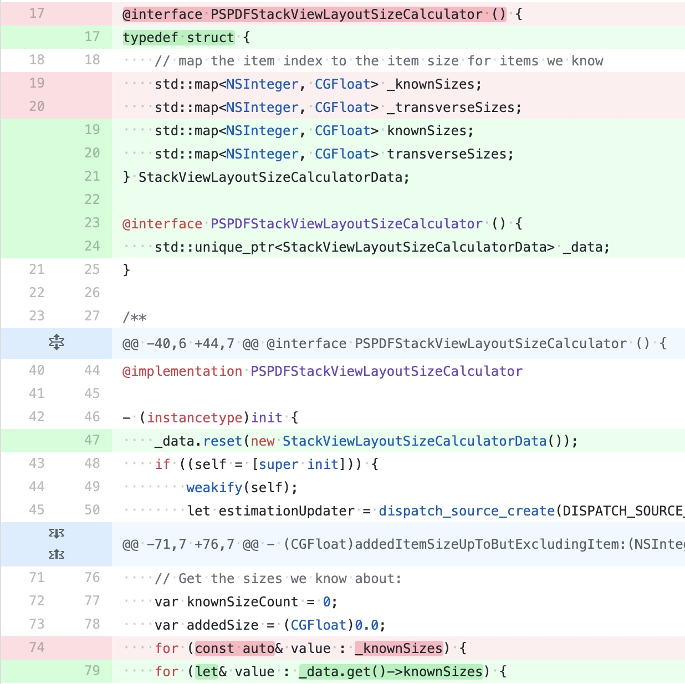

# 包大小
## 抖音品质建设 - iOS 安装包大小优化实践篇

[抖音品质建设 - iOS 安装包大小优化实践篇](https://juejin.cn/post/6916317500992913421)

文章内容包括：

- AppStore 对安装包的限制沿革以及 App 花费精力优化 iOS 安装包将获得什么收益；
- 如何去分析一个安装包；
- 如何在线下准确把控安装包大小对 AppStore 上影响；
- 常见的一些包大小优化方式；
- 一些影响包大小的编码习惯。

### AppStore 部分

AppStore 的限制：

- 2017 年 9 月，限制从 100MB 提升到了 150MB；
- 2019 年 5 月下旬，苹果把 OTA 下载限制放宽到 200MB；
- iOS 13 发布之后 iOS13 及以上用户可以使用流量下载超出 200MB 的 App， 但需要用户「设置」选择策略，默认为「超过 200MB 请求许可」，而 iOS13 以下用户仍然无法下载。

__TEXT 段大小限制，安装包内最大二进制所有架构的总和不超过 500MB。（应该没有还要支持 iOS8 的应用了吧）。

> 除了 Apple 的限制外，包大小的劣化一定程度上意味着更加慢的启动速度；更多的的代码逻辑；更低研发效率；过于复杂的代码还会带来对代码修改的风险将对稳定性产生负面影响；让性能等基础体验变差，所以包大小不是一个孤立的指标，它从侧面反映出 App 的健康状态。
> 

### 安装包分析

影响下载和安装大小的内容都集中在 .app 中。而解压后的占用 .app 大部分的大小的文件如下：

- 主二进制（和.app 同名的 MachO 文件）；
- Frameworks（App 自身引入的动态库）；
- Plugins （App Extension 本质依然是动态的可执行文件）；
- xxx.lproj（原生的翻译资源）；
- 各种资源 Bundle。

上传到 AppStore Connect 到之后，Apple 对安装包做了一些调整：

- App Slicing 对于不同架构的裁剪，可执行文件只剩下单架构；
- Asset.car 中图片只留下设备需要的特定尺寸和压缩算法的变体；
- 二进制部分 __TEXT 段的通过 FirePlay 进行加密导致 __TEXT 段的压缩比为 1（ iOS 13+ 以上设备下载变体中苹果移除了这个加密 ）；

LinkMap 中包含了可执行文件的架构信息，段表，链接了的所有文件，以及文件中各符号占用的大小。其实通过分析 LinkMap 就基本得到了可执行文件中包含了哪些东西。

### 优化手段

二进制部分的优化：

- 重命名部分段绕过 __TEXT 段 FirePlay 加密；
- 多个可执行文件中存在多份的相同代码，主要是 Extension 和主二进制共用同一个库导致的，可以考虑使用动态库，或者抽一个精简的静态库给 Extension 使用；
- 死代码裁剪，在构建完成之后如果是 C 、C++ 等静态的语言的代码、一些常量定义，如果发现没有被使用到将会被标记为 Dead code。开启 `DEAD_CODE_STRIP = YES` 这些 Dead code 将不会被打包到安装包中；
- 编译期优化参数， `GCC_OPTIMIZATION_LEVEL` 定义了 clang 用什么优化等级进行编译优化。这里的配置比较多，可以看下文章里的相关说明；
- 链接期优化参数， LLVM 提供链接期编译优化，通过设置工程中的 Link-Time Optimization 进行控制。

资源文件部分优化：

- 无用资源扫描和移除；
- 资源动态化，一般都是比较大的图片；
- On-Demand Resource ；
- 资源压缩；

无用代码清理：

- 静态扫描，对于 C/C++ 等静态语言来说，编译器会帮助我们将没有使用到的代码标记为 Dead Code ，最终不会打到安装包中。对于 Objective-C 这种动态语言来说，结果则没有这么准确；
- 使用 GCOV 或者 LVVM Profile 二进制的插桩，会影响包大小和性能，无法过审；
- 基于 Runtime 实现轻量级的运行时类覆盖率方案，通过 `flags & RW_INITIALIZED` 可以判断类是否有初始化，通过也可以找到使用率比较小的场景。

编码习惯和建议：

- Objective-C Method 和 C 函数，基于 Objective-C 的运行时，对应的方法在编译时生成的数据比 C 函数要大，所以内部应该尽量使用 C 函数来实现；
- Property vs IVAR ， `property` 会自动生成 set 和 get 方法，增加包大小；
- 减少 Block 的使用， Block 是一个特殊的 Objective-C 对象，编译时会生成比较多的相关代码；
- 减少参数个数；
- 高频率使用的宏不要使用多行的方式编写；
- 避免代码的复制粘贴。

## Objective-C Direct Methods

[https://pspdfkit.com/blog/2020/objc-type-encodings/](https://pspdfkit.com/blog/2020/objc-type-encodings/)

[Clang 13 documentation](https://clang.llvm.org/docs/AttributeReference.html#objc-direct)

commit : 

[Implement __attribute__((objc_direct)), __attribute__((objc_direct_me... · llvm/llvm-project@d4e1ba3](https://github.com/llvm/llvm-project/commit/d4e1ba3fa9dfec2613bdcc7db0b58dea490c56b1)

Clang 13 新增了 `objc_direct` 声明，对应的 Xcode 版本为 12 。使用 `objc_direct` 标记的 Objective-C 方法为直接派发方法。 `direct` 方法在调用时类似于静态方法，降低了一定的性能损耗，但是也牺牲了 Objective-C 的一些特性。

`direct` 方法的消息发送会像 C 函数那样直接调用实现，没有走 Objective-C 的消息发送流程。这里速度会比较快和有可能进行函数内联，这同时意味着方法不能够被重写或者动态替换。因此 `direct` 方法不会出现在 `class` 的方法列表中，可以减少代码段的大小。虽然说 `direct` 方法会当做 C 函数来进行静态调用，但是它仍然遵循以下 Objective-C 语义：

- 如果接收者为 `nil` ，则不会进行任何处理和返回方法返回值中对应的 `zero`  值；
- 调用 `direct` 方法也会触发 `class` 的初始化，包括调用 `+initiablize` 方法；
- 保留方法选择器的隐式参数 `_cmd` ，但是如果 `_cmd` 参数没有在方法中进行调用，那么实现中将不会保留对 `_cmd` 的引用，以减少代码段的大小。

同时不支持以下操作：

- 在 `protocol` 中声明 `direct` 方法；
- 在子类重写 `direct` 方法；
- 在子类中重写非 `direct` 方法，同时定义为 `direct` ；
- 相同的方法在不同的类接口中对 `direct` 的声明不一致；
- 在 `interface` 和 `implement` 中对 `direct` 的声明不一致；
- 不可以通过 `@selector` 和方法名来获取 `direct` 方法的 `SEL` 。

`class` 的 `interface` 包括了 `class` 的 `@interface` block ，extensions ， categories ，protocol 和父类的 `interface` 。

Objective-C 属性也支持声明为 `direct` 属性，在没有显示声明 `getter` 和 `setter` 的前提下，会默认声明为 `direct` 。

如果需要批量声明，可以使用 `objc_direct_members` 声明。可以在 `@interface` 或者 `@implementation` 中进行声明，对应的 `.m` 中的方法都会被设为 `direct` 。当  `objc_direct_members` 放置在 `@interface` 时，只有出现在 `@interface` 的方法会设置为 `direct` ，这包括了属性的隐式方法声明。

如果在 `@implementation` 中进行声明，除了已在其它 `@interface` 声明为 `non-direct` 的方法，其它方法都会声明为 `direct` 。

如果没办法保证外部调用会如何处理方法，那么比较保守的策略就是只处理 `.m` 里的私有方法和属性。

[Pierre H. 🔥🌸 on Twitter: "About objc_direct, a thread.I should have probably anticipated that people would raise eyebrows and spent more time explaining the point in the LLVM commit, so here it is... https://t.co/zgnaKD6n4A / Twitter"](https://twitter.com/pedantcoder/status/1197269246289444864)

这条推下面详细说明了 Objective-C 消息发送机制带来的损耗，主要包括以下四方面：

- 代码段大小，由于需要查找方法指针 `IMP` ，所以需要传递 `sekf` 和 `_cmd` 参数。每次调用会带来额外 8 字节的消耗，由于 `objc_msgSend` 的调用非常频繁，所以 8 字节叠加后占比非常大。在 CloudKit 中，这两个指令占了 `__text` 段 10.7% 的大小；
- 优化阻碍，为了更强的动态性和 ARC 等特性， Objective-C 要求编译器做出巨大的保护性编程。拒绝内联是比较明显的一个问题，还有的是在获取可读的 `integer` 属性时也会带来影响，ARC 会插入 `objc_retain()/objc_releas()` 方法包围属性的 `getter` 方法；
- 静态元数据，每个 Objective-C 的方法都会增加 150-250 字节大小。
    - 类的方法列表中会增加 24 字节；
    - 方法的 `type` 字符串超过 60 字节，如果不使用 `NSInvocation` 则没有不需要该字符串；
    - 方法的选择器平均为 20+ 字节。
- 运行时元数据，为了加快消息发送的速度，运行时会创建 `IMP` 缓存，即使是一些只调用一次的方法，也会带进程带来负担，同时由于运行时初始化时需要重定位指针，也会对启动性能带来影响。

[Objective-C Direct Methods](https://nshipster.com/direct/)

大多数情况下， `direct` 方法其实不会带来明显的性能收益， `objc_msgSend` 的处理速度其实非常快，这得益于极其侵略的缓存策略，广泛的底层优化以及现代处理器的进步。在存量代码比较多的情况下，把方法改写为 `direct` 会减少一定的代码段大小。

[Direct Calls with Objective-C | PSPDFKit](https://pspdfkit.com/blog/2020/improving-performance-via-objc-direct/)

性能相关数据：

PSPDFKit 替换了 3717 个方法，减少了 700 KB ，平均每个方法减少了 200 字节。

## 避免 Objective-C Type Encoding 过大

[Preventing Surprisingly Large Objective-C Type Encodings | PSPDFKit](https://pspdfkit.com/blog/2020/objc-type-encodings/)

在进行 Objective-C 和 C++ 混编时，类型编码（ Type Encodings ）会变成几千个字符，会影响包大小和性能。

### Type Encodings

Objective-C 的 `selector` 只会包含名字和参数个数，每个参数的类型则会保存在方法的 Type Encodings 中，编码为一个简单的字符串。如果带有 C++ 类型，字符串会变得很长和增加二进制包大小。 `NSMethodSignature` 用于帮助解析参数字符串。比如说 `CGRect` ，对应的 Type Encoding 字符串为： `{CGRect={CGPoint=dd}{CGSize=dd}}16@0:8` 。

对应 C++ 类型来说就比较惊喜了，比如说 `std::unordered_map<PSPDFAnnotationPlaceholderState, NSString *>` ，转换为字符串之后超过 3000 个字符串：

```cpp
PSPDFAnnotationPlaceholder._actionsForStates: (3176) {unordered_map<PSPDFAnnotationPlaceholderState
  , NSString *, std::__1::hash<PSPDFAnnotationPlaceholderState>, std::__1::equal_to<PSPDFAnnotationPlaceholderState>,
  std::__1::allocator<std::__1::pair<const PSPDFAnnotationPlaceholderState, NSString *> > >="__table_"{__hash_table
    <std::__1::__hash_value_type<PSPDFAnnotationPlaceholderState, NSString *>, std::__1::__unordered_map_hasher
    <PSPDFAnnotationPlaceholderState, std::__1::__hash_value_type<PSPDFAnnotationPlaceholderState, NSString *>,
    std::__1::hash<PSPDFAnnotationPlaceholderState>, true>, std::__1::__unordered_map_equal<PSPDFAnnotationPlaceholderState, std::__1::__hash_value_type<PSPDFAnnotationPlaceholderState, NSString *>, std::__1::equal_to<PSPDFAnnotationPlaceholderState>, true>, std::__1::allocator<std::__1::__hash_value_type<PSPDFAnnotationPlaceholderState, NSString *> > >="__bucket_list_"{unique_ptr<std::__1::__hash_node_base<std::__1::__hash_node<std::__1::__hash_value_type<PSPDFAnnotationPlaceholderState, NSString *>, void *> *> *[], std::__1::__bucket_list_deallocator<std::__1::allocator<std::__1::__hash_node_base<std::__1::__hash_node<std::__1::__hash_value_type<PSPDFAnnotationPlaceholderState, NSString *>, void *> *> *> > >="__ptr_"{__compressed_pair<std::__1::__hash_node_base<std::__1::__hash_node<std::__1::__hash_value_type<PSPDFAnnotationPlaceholderState, NSString *>, void *> *> **, std::__1::__bucket_list_deallocator<std::__1::allocator<std::__1::__hash_node_base<std::__1::__hash_node<std::__1::__hash_value_type<PSPDFAnnotationPlaceholderState, NSString *>, void *> *> *> > >="__value_"^^{__hash_node_base<std::__1::__hash_node<std::__1::__hash_value_type<PSPDFAnnotationPlaceholderState, NSString *>, void *> *>}"__value_"{__bucket_list_deallocator<std::__1::allocator<std::__1::__hash_node_base<std::__1::__hash_node<std::__1::__hash_value_type<PSPDFAnnotationPlaceholderState, NSString *>, void *> *> *> >="__data_"{__compressed_pair<unsigned long, std::__1::allocator<std::__1::__hash_node_base<std::__1::__hash_node<std::__1::__hash_value_type<PSPDFAnnotationPlaceholderState, NSString *>, void *> *> *> >="__value_"Q}}}}"__p1_"{__compressed_pair<std::__1::__hash_node_base<std::__1::__hash_node<std::__1::__hash_value_type<PSPDFAnnotationPlaceholderState, NSString *>, void *> *>, std::__1::allocator<std::__1::__hash_node<std::__1::__hash_value_type<PSPDFAnnotationPlaceholderState, NSString *>, void *> > >="__value_"{__hash_node_base<std::__1::__hash_node<std::__1::__hash_value_type<PSPDFAnnotationPlaceholderState, NSString *>, void *> *>="__next_"^{__hash_node_base<std::__1::__hash_node<std::__1::__hash_value_type<PSPDFAnnotationPlaceholderState, NSString *>, void *> *>}}}"__p2_"{__compressed_pair<unsigned long, std::__1::__unordered_map_hasher<PSPDFAnnotationPlaceholderState, std::__1::__hash_value_type<PSPDFAnnotationPlaceholderState, NSString *>, std::__1::hash<PSPDFAnnotationPlaceholderState>, true> >="__value_"Q}"__p3_"{__compressed_pair<float, std::__1::__unordered_map_equal<PSPDFAnnotationPlaceholderState, std::__1::__hash_value_type<PSPDFAnnotationPlaceholderState, NSString *>, std::__1::equal_to<PSPDFAnnotationPlaceholderState>, true> >="__value_"f}}}
```

### 扫描二进制中对应的字符串大小

使用 `strings [Foo.app.Foo](http://Foo.app.Foo) | grep -e '{'` 扫描二进制包可以找到对应的 Type Encoding 字符串。作者写了个 Swift 工具，可以快速查找项目中 Type Encoding 字符串比较大的方法：

[Runtime Scanner to find large ObjC encodings. Inspired by https://medium.com/@dmaclach/objective-c-encoding-and-you-866624cc02de - this code scans the runtime to find excessive Objective-C type encodings, usually created when you mix it with C++. We were able to reduce the binary size by 100KB with rewriting just a few methods that were extremely large.](https://gist.github.com/steipete/2d50571f0fd4963ebe9b0062fec0976f)

### 如何调整

有很多种方法隐藏 C++ 对象，作者通常创建一个单独的 `struct` 包含所有 C++ 对象，然后把这个 `struct` 放到 Objective-C 对应的类中，使用 `std::unique_ptr` 来进行声明。



### 结果

作者使用 [https://github.com/google/bloaty](https://github.com/google/bloaty) 来进行测量，最后发现大概减少了 100KB ，即二进制文件的 0.5% ，虽然不是很多，但是作者只花了一天，有兴趣的也可以自己试一下。