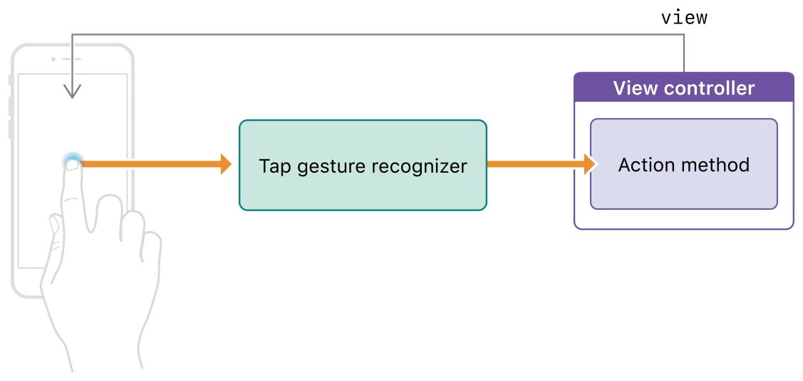
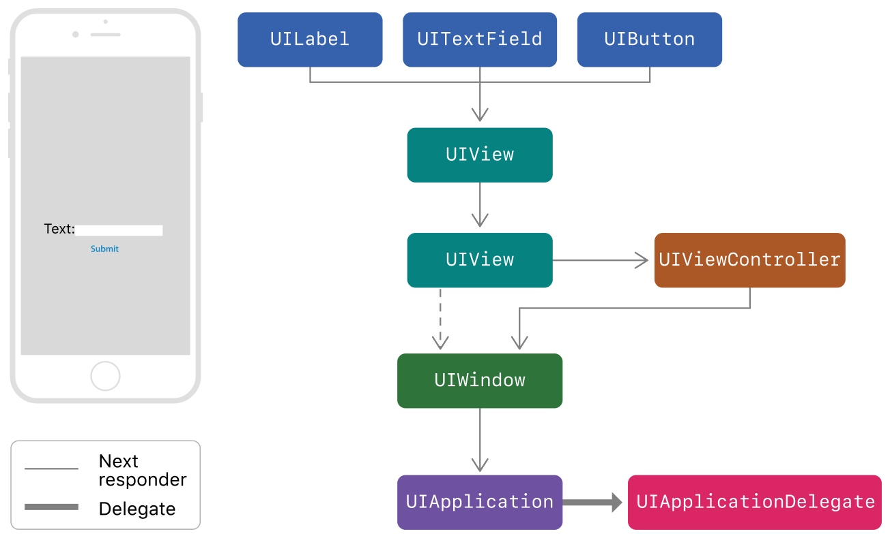
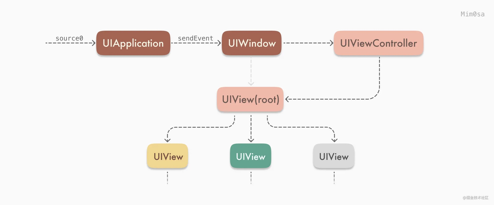
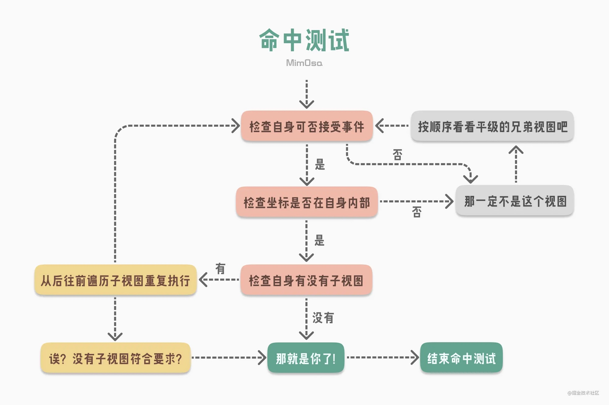
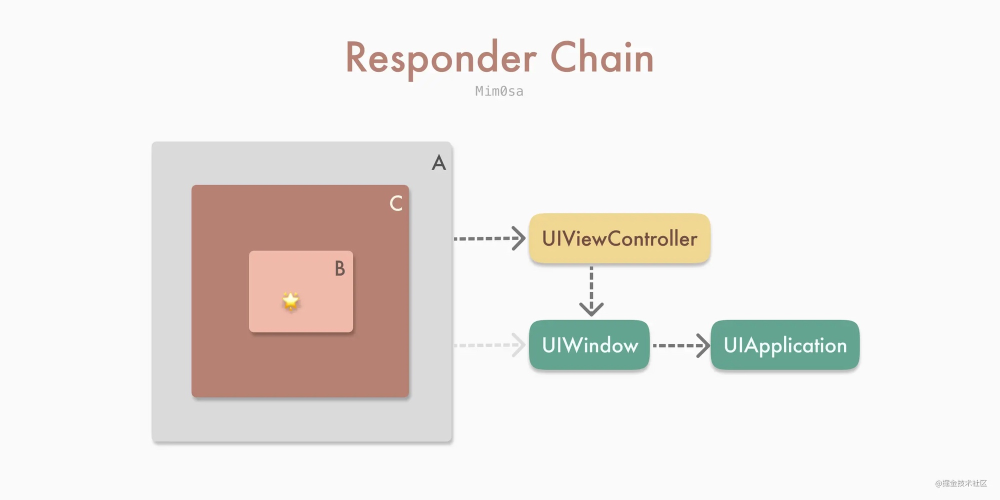
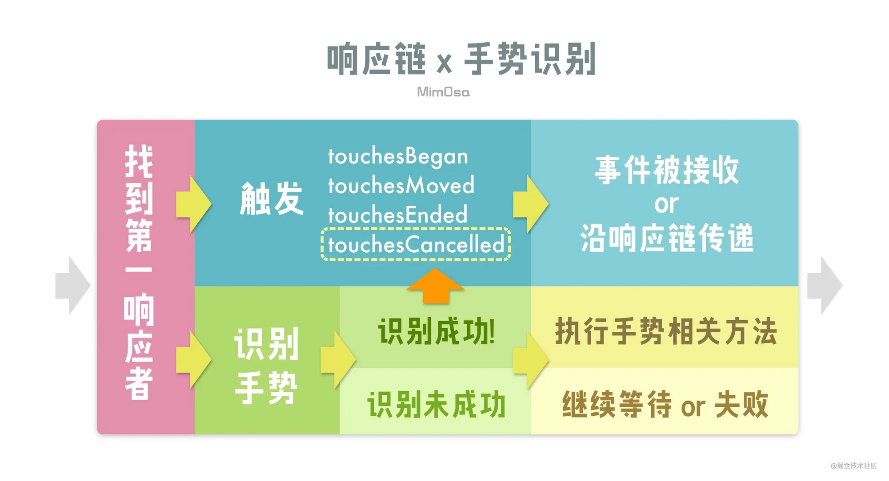
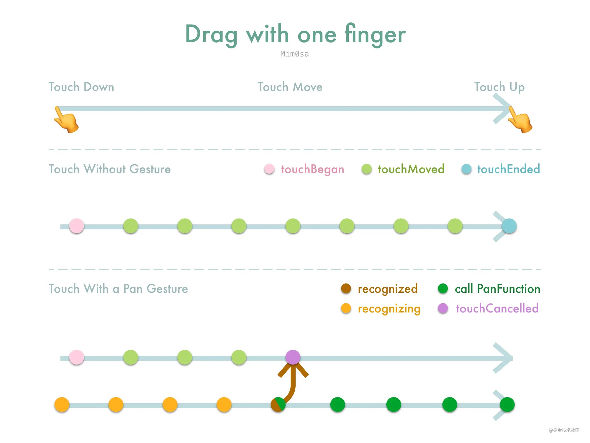
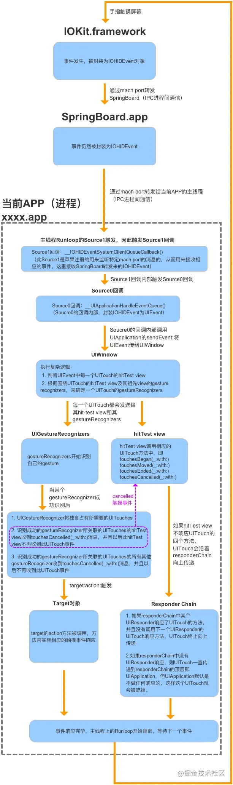

# 点击，按压与手势
## 官方文档

[Apple Developer Documentation](https://developer.apple.com/documentation/uikit/touches_presses_and_gestures)

### 处理 UIKit 手势

[Apple Developer Documentation](https://developer.apple.com/documentation/uikit/touches_presses_and_gestures/handling_uikit_gestures)

使用手势可以使得点击处理更加简单和创建统一的用户体验。

手势识别器（ Gesture Recognizers ）是在自定义控件上处理点击和按压事件最简单的方法。可以在任何控件上添加一到多个手势。手势识别器封装了所有需要处理和解释对应传入事件的逻辑，并将它们和已知的模式进行匹配。当检测到对应的模式时，手势识别器会通知对应的目标对象，可以是一个 `ViewController` ，也可以是控件（ `View` ）自己，或者 App 中的任何一个对象。

手势识别器通过 Target-Action 的方式来发送通知：



手势识别器分为两种类型：离散的和连续的。离散的手势识别器只会手势被识别后调用一次 Action 方法。而连续的手势则不同，当检测到满足初始化的标准时，它会多次调用 Action 方法，借此通知你手势信息的变化，比如说 `UIPanGestureRecognizer` 。
可以通过 `UIGestureRecognizer` 的 `state` 进行不同的处理。

### `UITapGestureRecognizer`

[Apple Developer Documentation](https://developer.apple.com/documentation/uikit/touches_presses_and_gestures/handling_uikit_gestures/handling_tap_gestures)

`UITapGestureRecognizer` 可以处理屏幕上短时间内的一次或多次点击。触发手势的手指不能从最初的接触点进行明显的移动，且支持配置点击的次数。可以通过配置点击次数来检测单次，双次或者三次点击。

如果 `UITapGestureRecognizer` 没有调用对应的 Target-Action ，可以检查下面的属性是否有正确设置：

- `isUserInteractionEnabled` 是否有设置为 `true` ， `UILabel` 和 `UIImageView` 默认设置为 `false` ；
- 点击的次数是否和 `numberOfTapsRequired` 一致；
- 点击的手指是否和 `numberOfTouchesRequired` 一致。

### `UILongPressGestureRecognizer`

[Apple Developer Documentation](https://developer.apple.com/documentation/uikit/touches_presses_and_gestures/handling_uikit_gestures/handling_long-press_gestures)

`UILongPressGestureRecognizer` 可以检测到一个或者多个手指（或者触摸笔）在屏幕上的长时间点击。支持配置持续时间和手指个数。

长按手势是持续类型的手势，这意味着当 `state` 改变时会调用多次 Target-Action 。当用户手指停留在屏幕上的时间满足长按手势的要求时，就会进入 `UIGestureRecognizerStateBegan` 状态。当手指开始移动或者点击事件有其它变化时进入 `UIGestureRecognizerStateChanged` 状态。即使手指移出最开始接收到事件的视图时， `state` 也会保持在 `UIGestureRecognizerStateChanged` 状态。直到手指离开屏幕，进入 `UIGestureRecognizerStateEnded` 状态。

通过长按手势可以实现 `context menu` ：

```swift
@IBAction func showResetMenu(_ gestureRecognizer: UILongPressGestureRecognizer) {
   if gestureRecognizer.state == .began {
      self.becomeFirstResponder()
      self.viewForReset = gestureRecognizer.view

      // Configure the menu item to display
      let menuItemTitle = NSLocalizedString("Reset", comment: "Reset menu item title")
      let action = #selector(ViewController.resetPiece(controller:))
      let resetMenuItem = UIMenuItem(title: menuItemTitle, action: action)

      // Configure the shared menu controller
      let menuController = UIMenuController.shared
      menuController.menuItems = [resetMenuItem]

      // Set the location of the menu in the view.
      let location = gestureRecognizer.location(in: gestureRecognizer.view)
      let menuLocation = CGRect(x: location.x, y: location.y, width: 0, height: 0)
      menuController.setTargetRect(menuLocation, in: gestureRecognizer.view!)

      // Show the menu.
      menuController.setMenuVisible(true, animated: true)
   }
}
```

如果长按手势的方法没有调用，可以检查下面的属性是否有正确设置：

- `isUserInteractionEnabled` 是否有设置为 `true` ， `UILabel` 和 `UIImageView` 默认设置为 `false` ；
- 点击持续时间是否大于 `minimumPressDuration` ；
- 点击的次数是否等于 `numberOfTapsRequired` ；
- 点击的手指是否等于 `numberOfTouchesRequired` 。

### `UIPanGestureRecognizer`

[Apple Developer Documentation](https://developer.apple.com/documentation/uikit/touches_presses_and_gestures/handling_uikit_gestures/handling_pan_gestures?language=objc)

手指在屏幕上移动时可以由 `UIPanGestureRecognizer` 进行处理，针对屏幕边缘的移动手势，可以交给 `UIPanGestureRecognizer` 的子类 `UIScreenEdgePanGestureRecognizer` 来处理。

1. 当手指的移动距离满足要求时， `UIPanGestureRecognizer` 就会进入 `UIGestureRecognizerStateBegan` 状态；
2. 当初始化完成后，随之而来的改变会使得 `UIPanGestureRecognizer` 进入 `UIGestureRecognizerStateChanged` 状态；
3. 当手指离开屏幕后，就会变为 `UIGestureRecognizerStateEnded` 状态。

为了简化追踪处理， `UIPanGestureRecognizer` 提供了 `translationInView:` 方法来获取用户手指距离原始位置的距离。苹果提供的示例：

```swift
var initialCenter = CGPoint()  // The initial center point of the view.
@IBAction func panPiece(_ gestureRecognizer : UIPanGestureRecognizer) {   
   guard gestureRecognizer.view != nil else {return}
   let piece = gestureRecognizer.view!
   // Get the changes in the X and Y directions relative to
   // the superview's coordinate space.
   let translation = gestureRecognizer.translation(in: piece.superview)
   if gestureRecognizer.state == .began {
      // Save the view's original position. 
      self.initialCenter = piece.center
   }
      // Update the position for the .began, .changed, and .ended states
   if gestureRecognizer.state != .cancelled {
      // Add the X and Y translation to the view's original position.
      let newCenter = CGPoint(x: initialCenter.x + translation.x, y: initialCenter.y + translation.y)
      piece.center = newCenter
   }
   else {
      // On cancellation, return the piece to its original location.
      piece.center = initialCenter
   }
}
```

## 使用响应链来处理事件

[Apple Developer Documentation](https://developer.apple.com/documentation/uikit/touches_presses_and_gestures/using_responders_and_the_responder_chain_to_handle_events)

Apps 使用 `UIResponder` 来接收和处理事件。 `UIResponder` 子类包括 `UIView` ， `UIViewController` 和 `UIApplication` 。 `UIResponder` 接收到原始事件数据后，需要对事件进行处理或者将其转发给另一个响应者。当你的 App 接收到事件时， UIKit 会自动找到最合适的 `UIResponder` 对象作为第一响应者。

未处理的事件会在响应链上进行传递，找到合适的响应者：



`UIControl` 会直接和它们的目标对象进行关联。当用户和 `UIControl` 进行交互时， `UIControl` 会直接发送 `Action` 消息给目标对象， `Action` 消息不是事件，但是仍可以享受响应链的好处。当目标对象为空时， UIKit 会在响应链上进行遍历，直到找到有实现对应 `Action` 方法的响应者。

UIKit 基于 `UIView` 的 `hit-testing` 来判断事件发生在哪。会通过 `UIView` 的 `hitTest:withEvent:` 方法来找到 `bounds` 包含该点击的最上层的子视图，将其作为第一响应者来处理。

如果点击的位置超出了 `UIView` 的 `bounds` ，那么 `hitTest:withEvent:` 方法就会忽略这个 `UIView` 以及所有它的 `subviews` 。

很多 `UIKit` 的类都重写了 `UIResponder` 的 `next` 属性来为我们返回下一个 `Responder` 对象：

- `UIView` ，如果它是 `viewController` 的 `root view` ，那么 `next` 就会返回这个 `viewController` ，否则就会返回 `superview` ；
- `UIViewController`
    - 如果 `viewController` 的 `view` 是 `window` 的 `root view`  ，那么 `next` 就返回 `window`  ；
    - 如果 `viewController` 由其它 `viewController` 弹出，那么 `next` 就返回其它 `viewController` ；
- `UIWindow` ， `next` 返回 `UIApplication` ；
- `UIApplication` ， `next` 返回 `app delegate` , 但是只有在 `app delegate` 是 `UIResponder` 时才会这样，它不能是 `view` 或者 `viewController` 。

## iOS 响应链

[iOS | 事件传递及响应链](https://juejin.cn/post/6894518925514997767)



iOS 中处理响应事件的是 `UIResponder` ，只要是 `UIResponder` 的子类都可以进行处理。在触摸事件发生后， `UIApplication` 会调用 `sendEvennt(_ event: UIEvent)` 方法来将 `UIEvent` 传递给 `UIWindow` ，而 `UIWindow` 则会通过 `hitTest` 和 `point(inside point: CGPoint, with event: UIEvent?) -> Bool` 方法来查找第一响应者。



- 检查自身是否可接收事件：
    - `view.isUserInteractionEnabled` 为 `true` ；
    - `view.alpha > 0.01` ；
    - `view.isHidden = false` 。
- 判断左边是否在自身内部，通过 `point(inside point: CGPoint, with event: UIEvent?) -> Bool` ，可以通过重写这个方法来扩大点击范围。

类似的代码实现：

```swift
class HitTestExampleView: UIView {
    override func hitTest(_ point: CGPoint, with event: UIEvent?) -> UIView? {
        if !isUserInteractionEnabled || isHidden || alpha <= 0.01 {
            return nil // 此处指视图无法接受事件
        }
        if self.point(inside: point, with: event) { // 判断触摸点是否在自身内部
            for subview in subviews.reversed() { // 按 FILO 遍历子视图
                let convertedPoint = subview.convert(point, from: self)
                let resultView = subview.hitTest(convertedPoint, with: event) 
                // ⬆️这句是判断触摸点是否在子视图内部，在就返回视图，不在就返回nil
                if resultView != nil { return resultView }
            }
            return self // 此处指该视图的所有子视图都不符合要求，而触摸点又在该视图自身内部
        }
        return nil // 此处指触摸点是否不在该视图内部
    }
}
```

当找到对应的第一响应者，响应链也随之确认了：



当确认响应链后，就会调用 `UIResponder` 中对应的方法：

```swift
class TouchesExampleView: UIView {
    override func touchesBegan(_ touches: Set<UITouch>, with event: UIEvent?) {
        print("Touches Began on " + colorBlock)
        super.touchesBegan(touches, with: event)
    }
    
    override func touchesMoved(_ touches: Set<UITouch>, with event: UIEvent?) {
        print("Touches Moved on " + colorBlock)
        super.touchesMoved(touches, with: event)
    }
  
    override func touchesEnded(_ touches: Set<UITouch>, with event: UIEvent?) {
        print("Touches Ended on " + colorBlock)
        super.touchesEnded(touches, with: event)
    }
}
```

如果是 `UIControl` 或者其子类，则会拦截掉其响应链的事件传递，不会向下调用 `UIResponder` 的相关方法。 `UIScrollView` 也是相同的工作机制。

[iOS | 响应链及手势识别](https://juejin.cn/post/6905914367171100680)



1. 在 `UIResponder` 的 `touches` 系列方法中的 `UITouch` 包含了收集到 的 `UIGestureRecognizers` 。在触发 `touches` 方法的过程中，也会判断 `UITouch` 是否符号收集到的手势；
2. 当成功识别手势时，第一响应者会收到 `touchesCancelled` 方法，且不会再收到来自该 `UITouch` 的 `touches` 事件，同时该 `UITouch` 关联的其它手势也会收到 `touchesCancelled` 。使得可以独占该 `UITouch` ；
3. 手势未识别成功时， `UIGestureRecognizer` 的 `state` 为 `.possible` ，表示可能有机会识别成功。



### 相关的属性配置

- `cancelsTouchesInView` ，默认为 `true` ，如果设置为 `false` ，那么当手势识别成功时，不会发送 `touchesCancelled` 给目标视图，目标视图还可以继续处理其它方法，比如说 `UIControl` 的 `.touchUpInside` 对应的方法等；
- `delaysTouchesBegan` ，默认为 `false` 。当设置为 `true` 时， `touches` 的系列方法会延迟到手势识别成功或者失败之后才开始；
- `delaysTouchesEnded` ，默认为 `true` ， `touchesEnded` 则会延迟大约 0.15s 触发，如果设置为 `false` ，那么 `touchesEnded` 则不会延迟，双击手势也会被识别为两次单击。

### UIControl 与手势识别

`UIControl` 接收 Target-Action 方法的方式是在其 `touches` 方法中识别、接收、处理，而手势的 `touches` 方法一定比其所在视图的 `touches` 方法早触发。对于自定义的 `UIControl` 来说，手势识别的优先级比 `UIControl` 自身处理事件的优先级高。

- 如果同时给 `UIControl` 添加了 `.touchUpInside` 方法和 `UITapGestureRecognizer` ，只会处理 `UITapGestureRecognizer` ；
- 如果给已经添加了 `UITapGestureRecognizer` 的视图添加一个 `UIControl` 作为子视图，同时给这个 `UIControl` 添加 `.touchUpInside` 方法，最终也只会处理该视图的 `UITapGestureRecognize` ，不会处理 `.touchUpInside` 方法，如果是 `UIButton` ，则会优先处理 `UIButton` 的方法；
- 如果想要两种都生效，可以设置 `cancelsTouchesInView` 为 false 。

手势识别器在大多数情况下，识别屏幕触摸事件的优先级，比控件本身的方法的优先级高。

## iOS 事件机制

[深入理解 iOS 事件机制](https://juejin.im/post/5d396ef7518825453b605afa#heading-23)

[iOS触摸事件全家桶](https://juejin.im/entry/6844903493640290311)

事件生命周期：




1. 系统通过 `hitTest:withEvent:` 方法沿视图层级树从底向上（从根视图开始）从后向前（从逻辑上更靠近屏幕的视图开始）进行遍历，最终返回一个适合响应触摸事件的 View ；
2. 原生触摸事件从 Hit-Testing 返回的 View 开始，沿着响应链从上向下进行传递；
3. 系统在探测阶段结束后创建了 `UITouch` ，并封装了 `UIEvent` 将其传递；
4. 手势上下文 `UIGestureEnvironment` 最先收到 `UIEvent` ，并负责通知给相关的 `UIGestureRecognizer` ；
5. `UIGestureEnvironment` 根据 `UIGestureRecognizer` 的 `delegate` 方法来判断其是否能够对触摸事件进行响应；
6. `UIGestureRecognizer` 仍然会先于 `UIControl` 接收到触摸事件；
7. `UIButton` 等部分 `UIControl` 会拦截其父 `View` 上的 `UIGestureRecognizer` ，但不会拦截自己和子 `View` 上的 `UIGestureRecognizer` ；
8. `UIButton` 会截断响应链的事件传递，也可以利用响应链来寻找 Action Method 。

## 应用

### 扩大子视图的点击范围

[谈谈响应链](https://juejin.im/post/5b83dcf9518825278e2729c5)

本文先是介绍了响应链的基本原理，然后讲述了如何响应在父视图外的子视图点击事件。

### 全局监听用户的点击事件

之前做过一个需求是用户在一定时间内没有点击屏幕就进行一些处理，我们可以对响应事件的顶层 `UIApplication` 进行操作，`hook` 它的 `sendEvent:` 事件，在用户停止点击时开始计时，记录用户没有点击的时间，进行一些操作。有几个需要注意的地方：

1. `sendEvent` 不仅仅是处理点击事件，所以需要判断下  `allTouches.count` 是否为 0 ，如果为 0 则表示不是点击事件；
2.  如果 `touch.phase == UITouchPhaseBegan` 表示用户点击屏幕，停止计时；
3. 如果 `phase == UITouchPhaseEnded` ，则表示有手指离开屏幕，因为有可能是多指同时点击，所以这里记录下 `countOfEnded` ，如果 `touches.count == countOfEnded` ，表示所有手指都离开屏幕，可以开始计时；

```objectivec
- (void)dt_sendEvent:(UIEvent *)event
{
    [self dt_sendEvent:event];

    if (event.allTouches.count == 0) {
        return;
    }
    NSArray <UITouch *> *touches = [event.allTouches allObjects];
    NSUInteger countOfEnded = 0;
    for (UITouch *touch in touches) {
        UITouchPhase phase = touch.phase;
        if (phase == UITouchPhaseBegan) {
            // 开始点击，停止计时
            // stopTimer 
						return;
        } else if (phase == UITouchPhaseEnded) {
            countOfEnded += 1;
        }
    }
    // 所有点击事件都结束，开始计时
    if (touches.count == countOfEnded) {
        // startTimer
    }
}
```

### 巧用 `UIApplication` 的 `sendAction`

[iOS Responder Chain: UIResponder, UIEvent, UIControl and uses](https://swiftrocks.com/understanding-the-ios-responder-chain.html)

这篇文章虽然也是讲了下 `UIResponder` ， `UIEvent` 和 `UIControl` ，但是后面有几个非常有趣的用法。

```swift
final class BlinkableView: UIView {
    override var canBecomeFirstResponder: Bool {
        return true
    }

    func select() {
        becomeFirstResponder()
    }

    @objc func performBlinkAction() {
        //Blinking animation
    }
}

UIApplication.shared.sendAction(#selector(BlinkableView.performBlinkAction), to: nil, from: nil, for: nil)
//Will precisely blink the last BlinkableView that had select() called.
```

`BlinkableView` 的 `canBecomeFirstResponder` 返回 `true` ，调用 `select` 时 `becomeFirstResponder()` 。然后说下具体用法，比如说现在我们想让当前的 `BlinkableView` 执行 `performBlinkAction()` 方法，其它的 `BlinkableView` 都不执行，可以通过 `UIApplication.shared.sendAction(#selector(BlinkableView.performBlinkAction), to: nil, from: nil, for: nil)` 方法来达到目的，当响应链找到第一个 `BlinkableView` (firstResponder) 时就会停止。

```swift
final class PushScreenEvent: UIEvent {

    let viewController: CoordenableViewController

    override var type: UIEvent.EventType {
        return .touches
    }

    init(viewController: CoordenableViewController) {
        self.viewController = viewController
    }
}

final class Coordinator: UIResponder {

    weak var viewController: CoordenableViewController?

    override var next: UIResponder? {
        return viewController?.originalNextResponder
    }

    @objc func pushNewScreen(sender: Any?, event: PushScreenEvent) {
        let new = event.viewController
        viewController?.navigationController?.pushViewController(new, animated: true)
    }
}

class CoordenableViewController: UIViewController {

    override var canBecomeFirstResponder: Bool {
        return true
    }

    private(set) var coordinator: Coordinator?
    private(set) var originalNextResponder: UIResponder?

    override var next: UIResponder? {
        return coordinator ?? super.next
    }

    override func viewDidAppear(_ animated: Bool) {
        //Fill info at viewDidAppear to make sure UIKit
        //has configured this view's next responder.
        super.viewDidAppear(animated)
        guard coordinator == nil else {
            return
        }
        originalNextResponder = next
        coordinator = Coordinator()
        coordinator?.viewController = self
    }
}

final class MyViewController: CoordenableViewController {
    //...
}

//From anywhere in the app:

let newVC = NewViewController()
UIApplication.shared.push(vc: newVC)

// 源代码漏了这段，给补上
extension UIApplication {
    func push(vc: CoordenableViewController) {
	      UIApplication.shared.sendAction(#selector(Coordinator.pushNewScreen(sender:event:)), 
																			  to: nil, 
																			  from: nil, 
																			  for: PushScreenEvent(viewController: CoordenableViewController))
	  }
}
```

调整后的响应链如下：

```swift
// MyView -> MyViewController -> Coordinator -> UIWindow -> UIApplication -> AppDelegate
```

当通过 `UIApplication` 发送 `action` 时，通过响应链查找可以找到 `Coordinator` ， `Coordinator` 通过 `PushScreenEvent` 进行 `push` 。

上面两个例子只是理论上可以这么做，原作者并没有在实际项目中尝试，这里是为了说明通过响应链做一些有趣的事情。

### 查找某个 `UIView` 所在 `viewController`

当我们需要获取某个 `UIView` 所在的 `viewController` 时，也可以通过响应链来进行处理：

```swift
extension UIView {
  var closestViewController: UIViewController? {
    if let nextResponder = self.next as? UIViewController {
      return nextResponder
    } else if let nextResponder = self.next as? UIView {
      return nextResponder.closestViewController
    } else {
      return nil
    }
  }
}
```