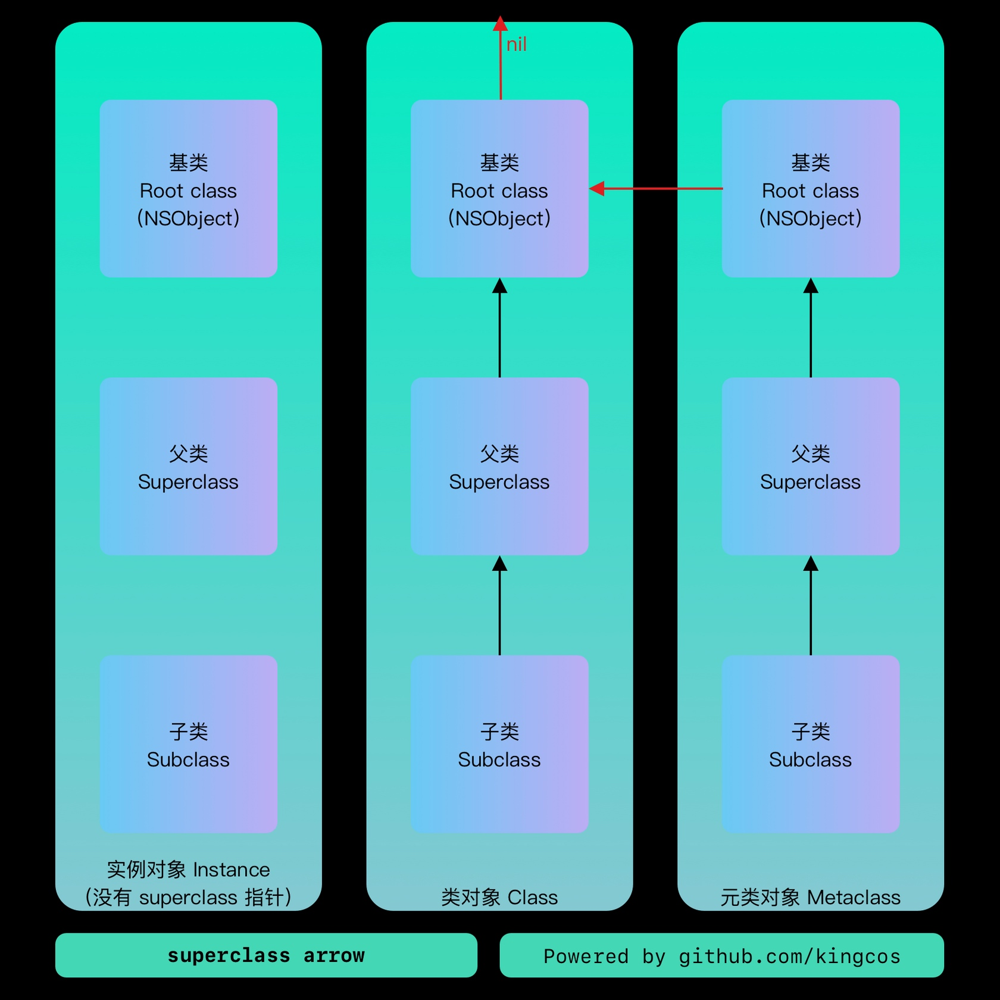
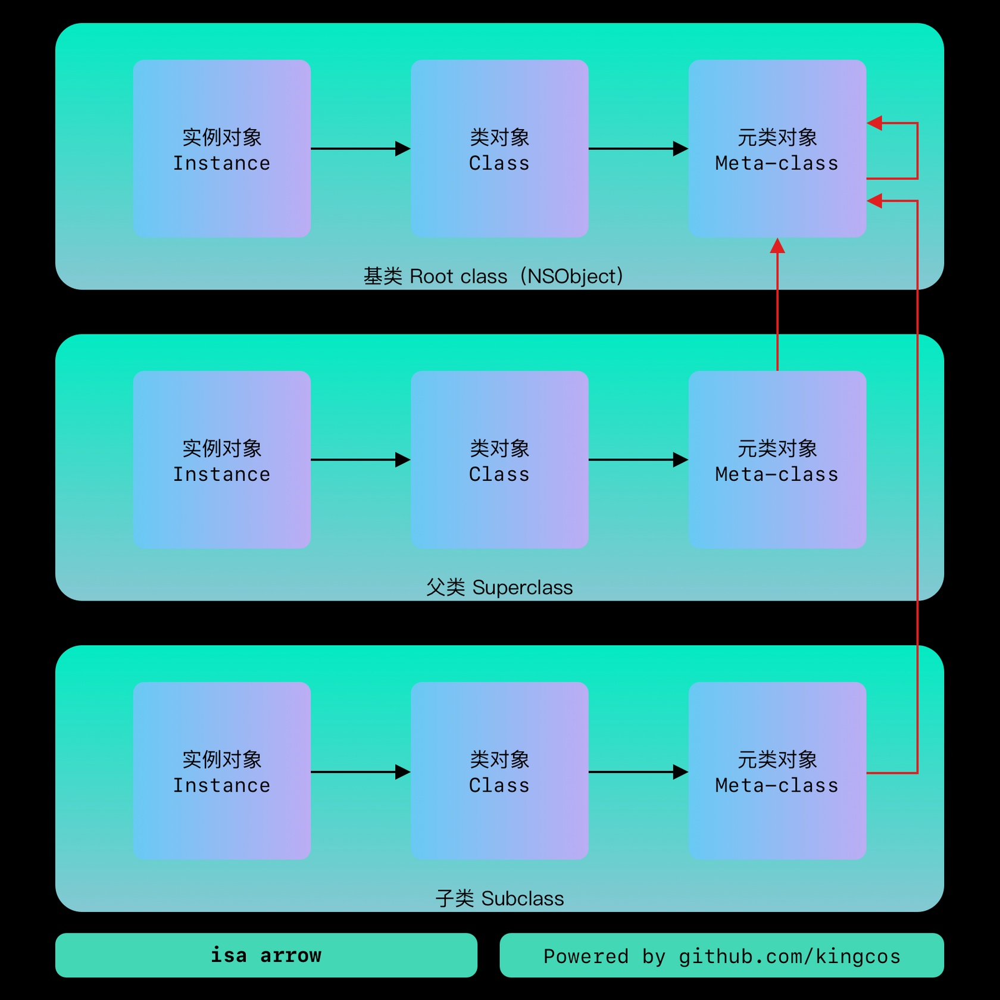

# Object
## Objective-C 中的对象

[Obj-C 中的对象](https://kingcos.me//posts/2019/objects_in_obj-c/)


`NSObject` 定了 `isa` 指针，用于指向 `Class` ，而 `Class` 本质上则是指向 `objc_class` 结构体的指针：

```objectivec
// NSObject.h

@interface NSObject <NSObject> {
#pragma clang diagnostic push
#pragma clang diagnostic ignored "-Wobjc-interface-ivars"
    Class isa  OBJC_ISA_AVAILABILITY;
#pragma clang diagnostic pop
}
```

而 `Class` 的本质则是指向 `objc_class` 结构体的指针，存放了 `isa` 、 `superclass` 、方法缓存等。

```c
typedef struct objc_class *Class;

// objc-runtime-new.h
struct objc_class : objc_object {
    // Class ISA;
    // 父类指针
    Class superclass;
    // 方法缓存
    cache_t cache;             // formerly cache pointer and vtable
    // 可读可写表（class_rw_t）等
    class_data_bits_t bits;    // class_rw_t * plus custom rr/alloc flags

    // ...
};

// objc-private.h
struct objc_object {
private:
    // isa 指针
    isa_t isa;

// ...
}

struct class_data_bits_t {
    // Values are the FAST_ flags above.
    uintptr_t bits;

    class_rw_t* data() {
        return (class_rw_t *)(bits & FAST_DATA_MASK);
    }

    // ...
}
```

`bits` 标志位作用：

- 0 - 1 ， `FAST_IS_SWIFT_LEGACY` ，是否来自 ABI 预稳定版本的 Swift ；
- 1 - 2 ， `FAST_IS_SWIFT_STABLE` ，是否来自 ABI 稳定版本的 Swift ；
- 2 - 3 ， `FAST_HAS_DEFAULT_RR` ，类或父类含有默认的持有或引用；
- 3 - 47 ， `FAST_DATA_MASK` ，指向 `class_rw_t` 结构体的指针；
- 47 - 63 ，字节对齐，填 0 。

`class_rw_t` 是可读可写， Read-Write ，在运行时会进行调整，而 `class_ro_t` 是只读的，在编译期已经确定，无法调整。

```c
struct class_rw_t {
    // Be warned that Symbolication knows the layout of this structure.
    uint32_t flags;
    uint32_t version;

    // 只读表的指针（const：不可修改指针指向内存空间中的数据）
    const class_ro_t *ro;

    // 方法、属性、协议信息，可用于运行时动态添加
    method_array_t methods;
    property_array_t properties;
    protocol_array_t protocols;

    // ...
};
```

`class_ro_t` 在编译时会被动态替换为 `class_rw_t` ，而 `class_rw_t` 则会通过指针指向 `class_ro_t` ：

```c
struct class_ro_t {
    // 标志位
    uint32_t flags;
    uint32_t instanceStart;
    // 实例大小
    uint32_t instanceSize;
#ifdef __LP64__
    uint32_t reserved;
#endif

    const uint8_t * ivarLayout;

    // 类名
    const char * name;
    method_list_t * baseMethodList;
    protocol_list_t * baseProtocols;
    // 成员变量
    const ivar_list_t * ivars;

    const uint8_t * weakIvarLayout;
    property_list_t *baseProperties;

    method_list_t *baseMethods() const {
        return baseMethodList;
    }
};
```

从上面的 `class_rw_t` 和 `class_ro_t` 可以看出为什么 Category 不支持添加变量，因为 Category 相关方法和属性是添加到 `class_rw_t` 中的，而 `class_ro_t` 表示的示例大小和属性在编译时已经确定了，不支持在运行时进行修改。

基类：



## isa 指针

[Obj-C 中的 isa 指针](https://kingcos.me//posts/2019/isa_in_objc/)



实例对象中的 `isa` 指向类对象，类对象中的 `isa` 指向元类对象，元类对象中的 `isa` 指向根元类对象（包括根元类对象也指向自己）。 `isa_t` 通过 `union` 来共享内存占用：

```c
struct objc_object {
private:
    isa_t isa;

// ...
}

union isa_t {
    isa_t() { }
    isa_t(uintptr_t value) : bits(value) { }

    Class cls;
    uintptr_t bits;
#if defined(ISA_BITFIELD)
    struct {
        ISA_BITFIELD;  // defined in isa.h
    };
#endif
};

// isa.h
// ARM 64
# if __arm64__
#   define ISA_MASK        0x0000000ffffffff8ULL
#   define ISA_MAGIC_MASK  0x000003f000000001ULL
#   define ISA_MAGIC_VALUE 0x000001a000000001ULL
#   define ISA_BITFIELD                                                      \
      uintptr_t nonpointer        : 1;                                       \
      uintptr_t has_assoc         : 1;                                       \
      uintptr_t has_cxx_dtor      : 1;                                       \
      uintptr_t shiftcls          : 33; /*MACH_VM_MAX_ADDRESS 0x1000000000*/ \
      uintptr_t magic             : 6;                                       \
      uintptr_t weakly_referenced : 1;                                       \
      uintptr_t deallocating      : 1;                                       \
      uintptr_t has_sidetable_rc  : 1;                                       \
      uintptr_t extra_rc          : 19
#   define RC_ONE   (1ULL<<45)
#   define RC_HALF  (1ULL<<18)

// _uintptr_t.h
#ifndef _UINTPTR_T
#define _UINTPTR_T
typedef unsigned long           uintptr_t;
#endif /* _UINTPTR_T */
```