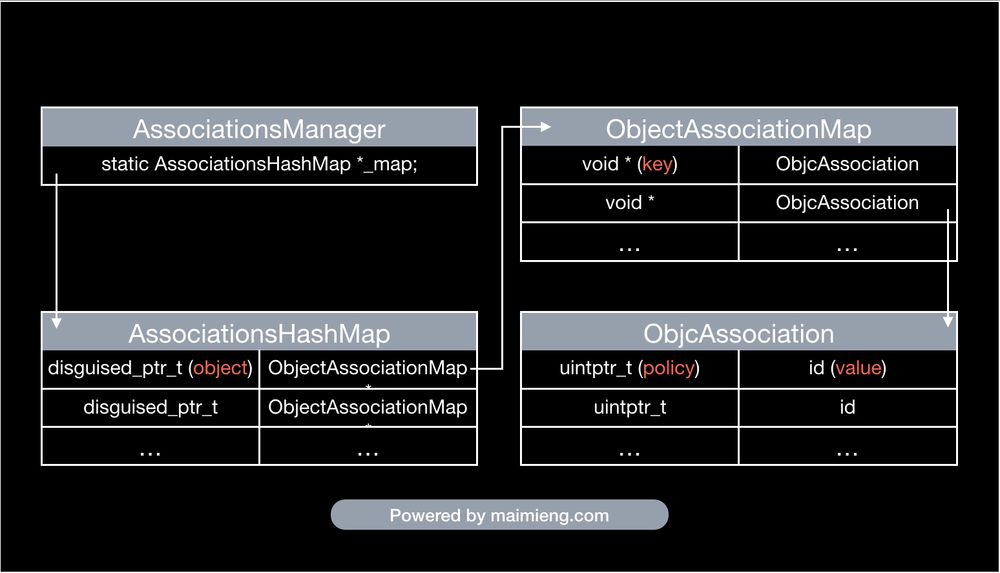

# Associated Objects

[Associated Objects](https://nshipster.com/associated-objects/)


通过以下三个函数可以进行关联对象的相关操作：

```objectivec
void objc_setAssociatedObject(id object, const void *key, id value, objc_AssociationPolicy policy);
id objc_getAssociatedObject(id object, const void *key);
void objc_removeAssociatedObjects(id object);
```

`key` 应该是常量的，唯一的，在 `setter` 和 `getter` 方法中可以进行访问：

```objectivec
static char kAssociatedObjectKey;

objc_getAssociatedObject(self, &kAssociatedObjectKey);
```

但是由于 `selector` 是唯一的，所以可以直接使用 `selector` ：

[https://twitter.com/bbum/status/3609098005](https://twitter.com/bbum/status/3609098005)

不要调用 `objc_removeAssociatedObjects` 来移除关联对象，因为会移除所有关联对象。正确的做法是调用 `objc_setAssociatedObject` 方法并传入 `nil` 来清除关联。

> 比起其他解决问题的方法，关联对象应该被视为最后的选择（事实上关联对象也不应该作为首选方法）。

## AssociatedObject 解析

[关联对象 AssociatedObject 完全解析 - 面向信仰编程](https://draveness.me/ao/)

- 关联对象其实就是 `ObjcAssociation` 对象
- 关联对象由 `AssociationsManager` 管理并在 `AssociationsHashMap` 存储
- 对象的指针以及其对应 `ObjectAssociationMap` 以键值对的形式存储在 `AssociationsHashMap` 中
- `ObjectAssociationMap` 则是用于存储关联对象的数据结构
- 每一个对象都有一个标记位 `has_assoc` 指示对象是否含有关联对象

## iOS 中的关联对象

[iOS 中的关联对象](https://kingcos.me/posts/2019/associated_objects_in_ios/)



### Weak Associated Object

[Weak Associated Object | 张不坏的博客](https://zhangbuhuai.com/post/weak-associated-object.html)

起一个中间层，叫 container 或者 wrapper 都可以：

```objectivec
@interface WeakAssociatedObjectWrapper : NSObject

@property (nonatomic, weak) id object;

@end

@implementation WeakAssociatedObjectWrapper

@end

@interface UIView (ViewController)

@property (nonatomic, weak) UIViewController *vc;

@end

@implementation UIView (ViewController)

- (void)setVc:(UIViewController *)vc {
    WeakAssociatedObjectWrapper *wrapper = [WeakAssociatedObjectWrapper new];
    wrapper.object = vc;
    objc_setAssociatedObject(self, @selector(vc), wrapper, OBJC_ASSOCIATION_RETAIN_NONATOMIC);
}

- (UIViewController *)vc {
    WeakAssociatedObjectWrapper *wrapper = objc_getAssociatedObject(self, _cmd);
    return wrapper.object;
}

@end
```

## 应用

[ChenYilong/CYLDeallocBlockExecutor](https://github.com/ChenYilong/CYLDeallocBlockExecutor)

通过 `Associated Objects` 在对象 `dealloc` 会释放的原理，可以给对象添加一个属性，然后在这个属性 `dealloc` 时进行相关操作，可以达到对象 `dealloc` 进行对应操作的目的。