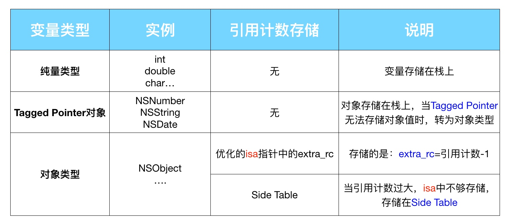
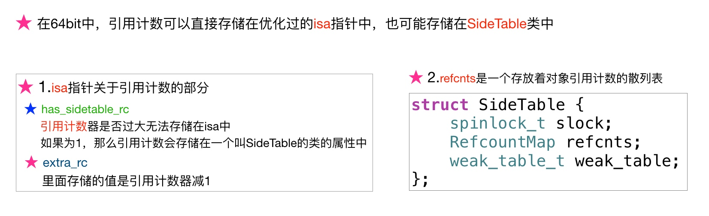
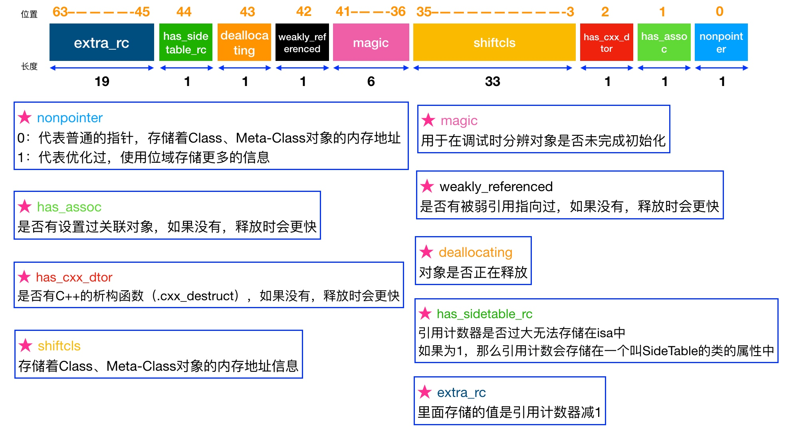
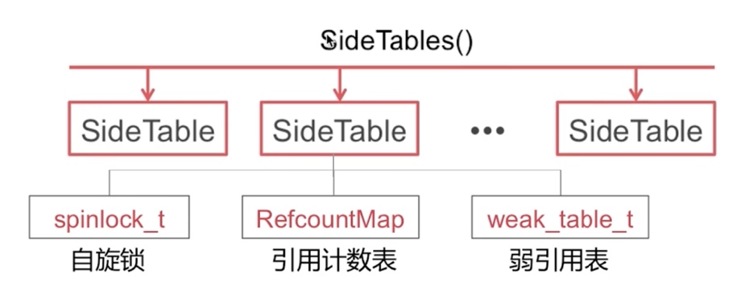
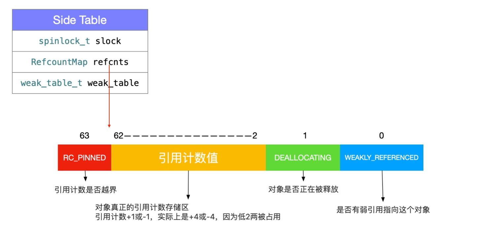
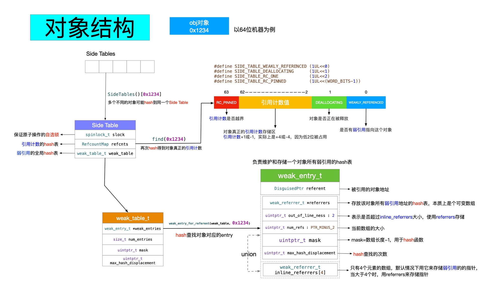
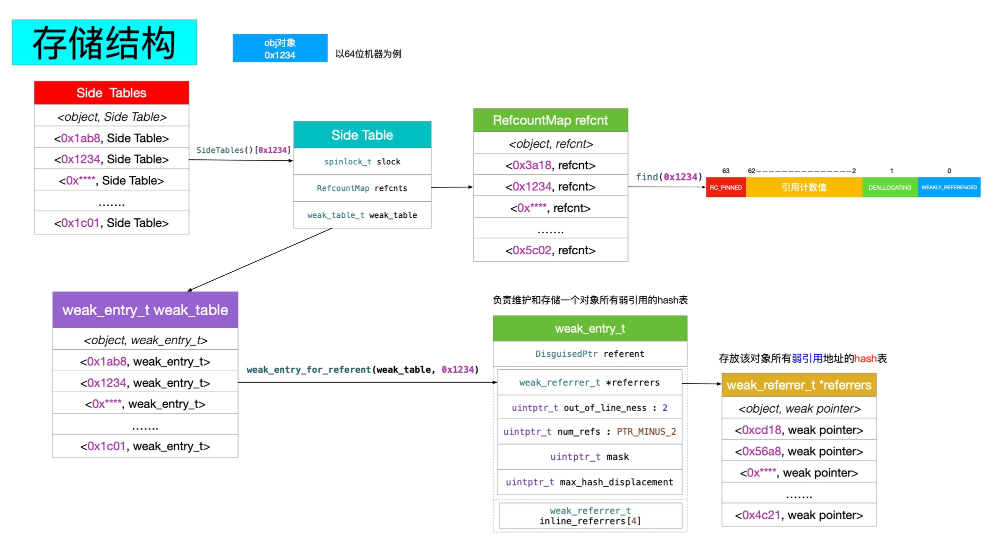

# Reference Counting
## 说明

[Clang 13 documentation](https://clang.llvm.org/docs/AutomaticReferenceCounting.html)

LLVM 的关于 ARC 的说明，非常长。

## 引用计数原理

[Objective-C 引用计数原理](http://yulingtianxia.com/blog/2015/12/06/The-Principle-of-Refenrence-Counting/)

引用计数如何存储：

1. 如果是 Tagged Pointer ，会直接使用其指针值作为引用计数返回；
2. 如果是 64位和 Objective-C 2.0 ，就会使用 `isa` 的部分空间来存储引用计数；
3. 如果 `isa` 部分空间不够存储引用计数，或者不是 64位和 Objective-C 2.0 ，就会使用散列表和 `SideTable` 来存储。

[isa 指针中变量对应的含义](https://www.notion.so/b27762eae5664cc0ad46b6db96bed8b8)

获取引用计数：

```objectivec
inline uintptr_t 
objc_object::rootRetainCount()
{
    assert(!UseGC);
		// 1. 如果是 Tagged Pointer ，则直接返回指针地址
    if (isTaggedPointer()) return (uintptr_t)this;

    sidetable_lock();
    isa_t bits = LoadExclusive(&isa.bits);
    if (bits.indexed) {
        // 2. 如果有经过优化，则 1 + bits.extra_rc ；
        uintptr_t rc = 1 + bits.extra_rc;
        // 3. 如果有使用 SideTable ，则加上 SideTable 的计数；
        if (bits.has_sidetable_rc) {
            rc += sidetable_getExtraRC_nolock();
        }
        sidetable_unlock();
        return rc;
    }

    sidetable_unlock();
    return sidetable_retainCount();
}
```

而 `sidetable_retainCount()` 则负责从 `SideTable` 中获取引用计数：

```objectivec
uintptr_t
objc_object::sidetable_retainCount()
{
    // 1. 根据指针地址获取对应的 SideTable
    SideTable *table = SideTable::tableForPointer(this);

    size_t refcnt_result = 1;
    
    spinlock_lock(&table->slock);
    // 2. 获取对象对应的 RefcountMap ；
    RefcountMap::iterator it = table->refcnts.find(this);
    if (it != table->refcnts.end()) {
        // 右移二位， SIDE_TABLE_RC_PINNED 可用于判断是否溢出。
        refcnt_result += it->second >> SIDE_TABLE_RC_SHIFT;
    }
    spinlock_unlock(&table->slock);
    return refcnt_result;
}
```

如官方文档所说的，不要使用 `retainCount` 方法，它不能真实表达对象所对应的引用计数，以及 Clang 一些优化也会对其造成影响。

[Apple Developer Documentation](https://developer.apple.com/documentation/objectivec/1418956-nsobject/1571952-retaincount)

修改引用计数：

1. `retain` 和 `release` ；
2. `alloc` ， `new` ， `copy` 和 `mutableCopy` ；
3. `autorelease` 。

## 黑箱中的 `retain` 和 `release`

[黑箱中的 retain 和 release](https://github.com/draveness/analyze/blob/master/contents/objc/%E9%BB%91%E7%AE%B1%E4%B8%AD%E7%9A%84%20retain%20%E5%92%8C%20release.md)

### `retain`

原文把 `rootRetain` 方法拆散了，方便解析，下面是 `rootRetain` 的全部实现，易于查看整个流程：

```cpp
id 
objc_object::rootRetain(bool tryRetain, bool handleOverflow)
{
    if (isTaggedPointer()) return (id)this;

    bool sideTableLocked = false;
    bool transcribeToSideTable = false;

    isa_t oldisa;
    isa_t newisa;

    do {
        transcribeToSideTable = false;
        // 加载 isa 的值
        oldisa = LoadExclusive(&isa.bits);
        newisa = oldisa;
        // 如果不支持 nonpointer ，即不用 isa 本身来存储引用计数，则直接走 SideTable 流程
        if (slowpath(!newisa.nonpointer)) {
            ClearExclusive(&isa.bits);
            if (!tryRetain && sideTableLocked) sidetable_unlock();
            if (tryRetain) return sidetable_tryRetain() ? (id)this : nil;
            else return sidetable_retain();
        }
        // 如果 isa 在 dealloc 流程中，则直接返回 nil
        if (slowpath(tryRetain && newisa.deallocating)) {
            ClearExclusive(&isa.bits);
            if (!tryRetain && sideTableLocked) sidetable_unlock();
            return nil;
        }
				// 
        uintptr_t carry;
        // 将 isa 的值加 1
        newisa.bits = addc(newisa.bits, RC_ONE, 0, &carry);  
        // 引用计数超出 extra_rc 限制，改用 SideTable
        if (slowpath(carry)) {
            // handleOverflow 为 false 
            if (!handleOverflow) {
                ClearExclusive(&isa.bits);
                // handleOverflow 改为 true ，从走 retain
                return rootRetain_overflow(tryRetain);
            }
            // 把 isa 的 extra_rc 恢复为一半，和做好准备把另外一半拷贝到 SideTable
            if (!tryRetain && !sideTableLocked) sidetable_lock();
            sideTableLocked = true;
            transcribeToSideTable = true;
            // 把 extra_rc 恢复为一半
            newisa.extra_rc = RC_HALF;
            newisa.has_sidetable_rc = true;
        }
    // StoreExclusive 更新 isa 的值
    } while (slowpath(!StoreExclusive(&isa.bits, oldisa.bits, newisa.bits)));
    // 如果说 isa 有溢出， 把一半的引用计数拷贝到 SideTable
    if (slowpath(transcribeToSideTable)) {
        sidetable_addExtraRC_nolock(RC_HALF);
    }

    if (slowpath(!tryRetain && sideTableLocked)) sidetable_unlock();
    return (id)this;
}
```

```cpp
bool objc_object::sidetable_addExtraRC_nolock(size_t delta_rc) {
    SideTable& table = SideTables()[this];

    size_t& refcntStorage = table.refcnts[this];
    size_t oldRefcnt = refcntStorage;
    // 溢出，直接返回 true
    if (oldRefcnt & SIDE_TABLE_RC_PINNED) return true;

    uintptr_t carry;
    size_t newRefcnt = 
        addc(oldRefcnt, delta_rc << SIDE_TABLE_RC_SHIFT, 0, &carry);
    if (carry) {
        // 如果有溢出，则将 refcntStorage 设为 SIDE_TABLE_RC_PINNED
        refcntStorage = SIDE_TABLE_RC_PINNED | (oldRefcnt & SIDE_TABLE_FLAG_MASK);
        return true;
    } else {
        // 没有溢出，新值赋给 refcntStorage
        refcntStorage = newRefcnt;
        return false;
    }
}
```

可以看到 `retain` 时会动态结合 `isa` 的 `extra_rc` 和 `SideTable` 来存储引用计数：

1. `extra_rc` 不需要查找，速度会更快，所以优先使用 `extra_rc` 管理引用计数；
2. 如果 `extra_rc` 溢出，则把 `extra_rc` 的一半拷贝到 `SideTable` 中， `SideTable` 并没有直接参与引用计数管理；
3. 如果引用计数为 1 ， `extra_rc` 为 0 ，保存的是额外的引用计数。

## `release`

```cpp
bool 
objc_object::rootRelease(bool performDealloc, bool handleUnderflow)
{
    if (isTaggedPointer()) return false;

    bool sideTableLocked = false;

    isa_t oldisa;
    isa_t newisa;

 retry:
    do {
        oldisa = LoadExclusive(&isa.bits);
        newisa = oldisa;
        // 如果不支持 nonpointer ，即不用 isa 本身来存储引用计数，则直接走 SideTable 流程
        if (slowpath(!newisa.nonpointer)) {
            ClearExclusive(&isa.bits);
            if (sideTableLocked) sidetable_unlock();
            return sidetable_release(performDealloc);
        }
        uintptr_t carry;
	      // extra_rc 减 1
        newisa.bits = subc(newisa.bits, RC_ONE, 0, &carry);
        // 如果不够，则走 SideTable 流程
        if (slowpath(carry)) {
            goto underflow;
        }
        // 调用 StoreReleaseExclusive 方法保存新的引用计数
    } while (slowpath(!StoreReleaseExclusive(&isa.bits, 
                                             oldisa.bits, newisa.bits)));

    if (slowpath(sideTableLocked)) sidetable_unlock();
    return false;

 underflow:
    newisa = oldisa;
    // 判断是否有使用 SideTable
    if (slowpath(newisa.has_sidetable_rc)) {
        // 将 handleUnderflow 设为 true ，递归调用
        if (!handleUnderflow) {
            ClearExclusive(&isa.bits);
            return rootRelease_underflow(performDealloc);
        }
        if (!sideTableLocked) {
            ClearExclusive(&isa.bits);
            sidetable_lock();
            sideTableLocked = true;
            goto retry;
        }
        // 从 SideTable 中获取 extra_rc 最大值的一半，即 RC_HALF
        size_t borrowed = sidetable_subExtraRC_nolock(RC_HALF);
        if (borrowed > 0) {
            // 将一半引用计数放到 extra_rc 中
            newisa.extra_rc = borrowed - 1;  
            bool stored = StoreReleaseExclusive(&isa.bits, 
                                                oldisa.bits, newisa.bits);
            if (!stored) {
                // 如果存放到 extra_rc 中失败，重新加载 isa 和尝试存放
                isa_t oldisa2 = LoadExclusive(&isa.bits);
                isa_t newisa2 = oldisa2;
                if (newisa2.nonpointer) {
                    uintptr_t overflow;
                    newisa2.bits = 
                        addc(newisa2.bits, RC_ONE * (borrowed-1), 0, &overflow);
                    if (!overflow) {
                        stored = StoreReleaseExclusive(&isa.bits, oldisa2.bits, 
                                                       newisa2.bits);
                    }
                }
            }
            // 如果还是失败，则把引用计数放回 SideTable
            if (!stored) {
                sidetable_addExtraRC_nolock(borrowed);
                goto retry;
            }
            sidetable_unlock();
            return false;
        }
        else {
			  // SideTable 为空，执行 dealloc ，不需要执行任何处理
        }
    }
    if (slowpath(newisa.deallocating)) {
		    // 对象正在释放
        ClearExclusive(&isa.bits);
        if (sideTableLocked) sidetable_unlock();
        return overrelease_error();
    }
    // 设置 deallocating 标志位
    newisa.deallocating = true;
    if (!StoreExclusive(&isa.bits, oldisa.bits, newisa.bits)) goto retry;

    if (slowpath(sideTableLocked)) sidetable_unlock();
    __sync_synchronize();
    if (performDealloc) {
        // 通过 objc_msgSend 直接执行 dealloc
        ((void(*)(objc_object *, SEL))objc_msgSend)(this, SEL_dealloc);
    }
    return true;
}
```

`release` 的处理流程和 `retain` 类似，多了一个 `dealloc` 的执行流程。

## 引用计数与 `weak`

[内存管理（四）引用计数与weak](https://wenghengcong.com/posts/7162dd05/)

源码解析在上面已经有提及，所以这里贴上这篇的文章里的图就好了。







